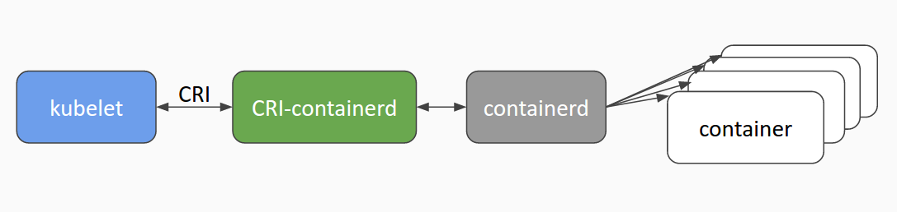

# cri-containerd
<p align="center">


</p>

[](https://travis-ci.org/kubernetes-incubator/cri-containerd)
[](https://goreportcard.com/report/github.com/kubernetes-incubator/cri-containerd)

`cri-containerd` is a [containerd](https://containerd.io/) based implementation of Kubernetes [container runtime interface (CRI)](https://github.com/kubernetes/kubernetes/blob/master/pkg/kubelet/apis/cri/v1alpha1/runtime/api.proto).

With it, you could run Kubernetes using containerd as the container runtime.

## Current Status
`cri-containerd` is in alpha:
* It is feature complete.
* It works with Kubernetes >= 1.7.
* It has passed all [CRI validation tests](https://github.com/kubernetes/community/blob/master/contributors/devel/cri-validation.md).
* It has passed all regular [node e2e tests](https://github.com/kubernetes/community/blob/master/contributors/devel/e2e-node-tests.md).
## Installing with Ansible and Kubeadm
For a multi node cluster installer and bring up steps using ansible and kubeadm refer [here](contrib/ansible/README.md).
## Custom Installation
For non ansible users, you can download the `cri-containerd` release tarball and deploy
kubernetes cluster using kubeadm as described [here](docs/installation.md).
## Getting Started for Developers
### Binary Dependencies and Specifications
The current release of `cri-containerd` has the following dependencies:
* [containerd](https://github.com/containerd/containerd)
* [runc](https://github.com/opencontainers/runc)
* [CNI](https://github.com/containernetworking/cni)

See [versions](./hack/versions) of these dependencies `cri-containerd` is tested with.

As containerd and runc move to their respective general availability releases,
we will do our best to rebase/retest `cri-containerd` with these releases on a
weekly/monthly basis. Similarly, given that `cri-containerd` uses the Open
Container Initiative (OCI) [image](https://github.com/opencontainers/image-spec)
and [runtime](https://github.com/opencontainers/runtime-spec) specifications, we
will also do our best to update `cri-containerd` to the latest releases of these
specifications as appropriate.
### Install Dependencies
1. Install development libraries:
* **libseccomp development library.** Required by cri-containerd and runc seccomp support. `libseccomp-dev` (Ubuntu, Debian) / `libseccomp-devel`
(Fedora, CentOS, RHEL). On releases of Ubuntu <=Trusty and Debian <=jessie a
backport version of `libsecomp-dev` is required. See [travis.yml](.travis.yml) for an example on trusty.
* **libapparmor development library.** Required by cri-containerd and runc apparmor support. To use apparmor on Debian, Ubuntu, and related distributions the installation of `libapparmor-dev` is required.
* **btrfs development library.** Required by containerd btrfs support. `btrfs-tools`(Ubuntu, Debian) / `btrfs-progs-devel`(Fedora, CentOS, RHEL)
2. Install other dependencies:
* **`nsenter`**: Required by CNI and portforward.
* **`socat`**: Required by portforward.
3. Install and setup a go 1.9.x development environment.
4. Make a local clone of this repository.
5. Install binary dependencies by running the following command from your cloned `cri-containerd/` project directory:
```bash
# Note: install.deps installs the above mentioned runc, containerd, and CNI
# binary dependencies. install.deps is only provided for general use and ease of
# testing. To customize `runc` and `containerd` build tags and/or to configure
# `cni`, please follow instructions in their documents.
make install.deps
```
### Build and Install cri-containerd
To build and install `cri-containerd` enter the following commands from your `cri-containerd` project directory:
```bash
make
sudo make install
```
#### Build Tags
`cri-containerd` supports optional build tags for compiling support of various features.
To add build tags to the make option the `BUILDTAGS` variable must be set.

```bash
make BUILD_TAGS='seccomp apparmor'
```

| Build Tag | Feature                            | Dependency                      |
|-----------|------------------------------------|---------------------------------|
| seccomp   | syscall filtering                  | libseccomp development library  |
| selinux   | selinux process and mount labeling | <none>                          |
| apparmor  | apparmor profile support           | libapparmor development library |
### Validate Your cri-containerd Setup
Another Kubernetes incubator project called [cri-tools](https://github.com/kubernetes-incubator/cri-tools)
includes programs for exercising CRI implementations such as `cri-containerd`.
More importantly, cri-tools includes the program `critest` which is used for running
[CRI Validation Testing](https://github.com/kubernetes/community/blob/master/contributors/devel/cri-validation.md).

Run the CRI Validation test to validate your installation of `cri-containerd`:
```bash
make test-cri
```
### Running a Kubernetes local cluster
If you already have a working development environment for supported Kubernetes version, you can
try `cri-containerd` in a local cluster:

1. Start `containerd` as root in a first terminal:
```bash
sudo containerd
```
2. Start `cri-containerd` as root in a second terminal:
```bash
sudo cri-containerd -v 2 --alsologtostderr
```
3. From the Kubernetes project directory startup a local cluster using `cri-containerd`:
```bash
CONTAINER_RUNTIME=remote CONTAINER_RUNTIME_ENDPOINT='/var/run/cri-containerd.sock' ./hack/local-up-cluster.sh
```
### Test
See [here](./docs/testing.md) for information about test.
## Documentation
See [here](./docs) for additional documentation.
## Contributing
Interested in contributing? Check out the [documentation](./CONTRIBUTING.md).

## Kubernetes Incubator
This is a [Kubernetes Incubator project](https://github.com/kubernetes/community/blob/master/incubator.md).
The project was established 2017/4/13. The incubator team for the project is:
* Sponsor: Dawn Chen ([@dchen1107](https://github.com/dchen1107))
* Champion: Yuju Hong ([@yujuhong](https://github.com/yujuhong))
* SIG: `sig-node`

For more information about `sig-node` and the `cri-containerd` project:
* [sig-node community site](https://github.com/kubernetes/community/tree/master/sig-node)
* Slack: `#sig-node` channel in Kubernetes (kubernetes.slack.com)
* Mailing List: https://groups.google.com/forum/#!forum/kubernetes-sig-node
## Code of Conduct
Participation in the Kubernetes community is governed by the
[Kubernetes Code of Conduct](./code-of-conduct.md).
