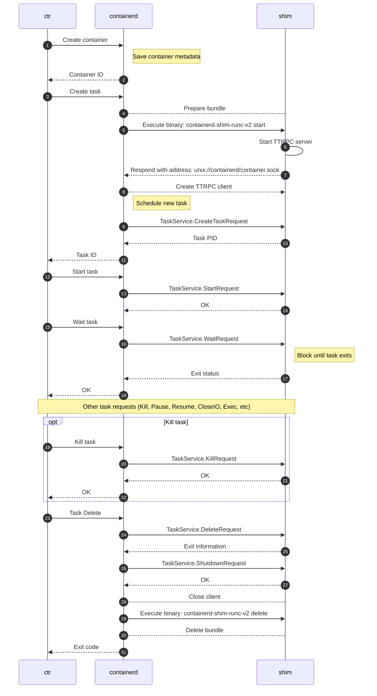

# Runtime v2

Runtime v2 introduces a first class shim API for runtime authors to integrate with containerd.

containerd, the daemon, does not directly launch containers. Instead, it acts as a higher-level manager
or hub for coordinating the activities of containers and content, that lower-level
programs, called "runtimes", actually implement to start, stop and manage containers,
either individual containers or groups of containers, e.g. Kubernetes pods.

For example, containerd will retrieve container image config and its content as layers, use the snapshotter to lay it out on disk, set up
the container's rootfs and config, and then launch a runtime that will create/start/stop the container.

This document describes the major components of the v2 runtime integration model, how the components interact
with containerd and the v2 runtime, and how to use and integrate different v2 runtimes.

To simplify the interaction, runtime v2 introduced a first class v2 API for runtime authors to integrate with containerd,
replacing the v1 API.
The v2 API is minimal and scoped to the execution lifecycle of a container.

This document is split into the following sections:

* [architecture](#architecture) - the major components, their purposes and relationships
* [usage](#usage) - how to invoke specific runtimes, and how to configure them
* [authoring](#shim-authoring) - how to author a v2 runtime

## Architecture

### containerd-runtime communication

containerd expects a runtime to implement several container control features, such as create, start and stop.

The high-level flow is as follows:

1. client requests from containerd to create a container
1. containerd lays out the container's filesystem, and creates the necessary config information
1. containerd invokes the runtime over an API to create/start/stop the container

However, containerd itself does not actually directly invoke the runtime to start the container.
Instead it expects to invoke the runtime, which will expose a socket - Unix-domain on Unix-like systems, named pipe on Windows -
and listen for container commands via [ttRPC](https://github.com/containerd/ttrpc) over that
socket.

The runtime is expected to process those operations. How it does so is entirely within the scope of the runtime implementation.
Two common patterns are:

* a single binary for runtime that both listens on the socket and creates/starts/stops the container
* a separate shim binary that listens on the socket, and invokes a separate runtime engine that creates/starts/stops the container

The separate "shim+engine" pattern is used because it makes it easier to integrate distinct runtimes implementing a specific runtime
engine spec, such as the [OCI runtime spec](https://github.com/opencontainers/runtime-spec).
The ttRPC protocol can be handled via one runtime shim, while distinct runtime engine implementations can
be used, as long as they implement the OCI runtime spec.

The most commonly used runtime _engine_ is [runc](https://github.com/opencontainers/runc), which implements the
[OCI runtime spec](https://github.com/opencontainers/runtime-spec). As this is a runtime _engine_, it is not
invoked directly by containerd; instead, it is invoked by a shim, which listens on the socket and invokes the runtime engine.

#### shim+engine Architecture

##### runtime shim

The runtime shim is what actually is invoked by containerd. It has minimal options on start beyond
being provided the communications port for containerd and some configuration information.

The runtime shim listens on the socket for ttRPC commands from containerd, and then invokes a separate program,
the runtime engine, via `fork`/`exec` to run the container. For example, the `io.containerd.runc.v2` shim invokes
an OCI compliant runtime engine such as `runc`.

containerd passes options to the shim over the ttRPC connection, which may include the runtime engine binary
to invoke. These are the `options` for the [`CreateTaskRequest`](#container-level-shim-configuration).

For example, the `io.containerd.runc.v2` shim supports including the path to the runtime engine binary.

##### runtime engine

The runtime engine itself is what actually starts and stops the container.

For example, in the case of [runc](https://github.com/opencontainers/runc), the containerd project provides the shim
as the executable `containerd-shim-runc-v2`. This is invoked by containerd and starts the ttRPC listener.

The shim then invokes the actual `runc` binary, passing it the container configuration, and the `runc` binary
creates/starts/stops the container typically via `libcontainer`->system apis.

#### shim+engine Relationship

Since each shim instance communicates with containerd as a daemon, while parenting containers via invoking independent runtimes,
it is possible to have one shim for multiple containers and invocations. For example,
you could have one `containerd-shim-runc-v2` communicating with one containerd, and it can
invoke ten distinct containers.

It even is possible to have one shim for multiple containers, each with its own actual runtime,
since, as described above, the runtime binary is passed as one of the options in `CreateTaskRequest`.

containerd does not know or care about whether the shim to container relationship is one-to-one,
or one-to-many. It is entirely up to the shim to decide. For example, the `io.containerd.runc.v2` shim
automatically groups based on the presence of
[labels](https://github.com/containerd/containerd/blob/b30e0163ac36c1a193604e5eca031053d62019c5/runtime/v2/runc/manager/manager_linux.go#L54-L60). In practice, this means that containers launched by Kubernetes, that are part of the same Kubernetes pod, are handled by a single
shim, grouping on the `io.kubernetes.cri.sandbox-id` label set by the CRI plugin.

The flow, then, is as follows:

1. containerd receives a request to create a container
1. containerd lays out the container's filesystem, and creates the necessary [container config](https://github.com/opencontainers/image-spec/blob/main/config.md) information
1. containerd invokes the shim, including container configuration, which uses that information to decide whether to launch a new socket listener (1:1 shim to container) or use an existing one (1:many)
   * if existing, return the address of the existing socket and exit
   * if new, the shim:
	 1. creates a new process to listen on a socket for ttRPC commands from containerd
	 1. returns the address to that socket to containerd
	 1. exits
1. containerd sends the shim a command to start the container
1. The shim invokes `runc` to create/start/stop the container

An excellent flow diagram is available later in this document under [Flow](#Flow).

## Usage

### Invoking Runtimes

A runtime - single instance or shim+engine - and its options, can be selected when creating a container via one of the exposed
containerd services (containerd client, CRI API,...), or via a client that calls into the containerd provided services.
Examples of containerd clients include `ctr`, `nerdctl`, kubernetes, docker/moby, rancher and others.

The runtime can also be changed via a container update.

The runtime name that is passed is a string that is used to identify the runtime to containerd. In the case of separate shim+engine,
this will be the runtime _shim_. Either way, this is the binary that containerd executes and expects to start the ttRPC listener.
The runtime name can be either a URI-like string, or, beginning with containerd 1.6.0, the actual path to the executable.

1. If the runtime name is a path, use that as the actual path to the runtime to invoke.
1. If the runtime name is URI-like, convert it to a runtime name using the below logic.

If the runtime name is URI-like, containerd will convert the passed runtime from the URI-like name to a binary name using the following logic:

1. Replaces all `.` with `-`
1. Takes the last 2 components, e.g. `runc.v2`
1. Prepends `containerd-shim`

For example, if the runtime name is `io.containerd.runc.v2`, containerd will invoke the shim as `containerd-shim-runc-v2`. It expects to
find the binary in its normal `PATH`.

containerd keeps the `containerd-shim-*` prefix so that users can `ps aux | grep containerd-shim` to see running shims on their system.

For example:

```bash
$ ctr --runtime io.containerd.runc.v2 run --rm docker.io/library/alpine:latest alpine
```

Will invoke `containerd-shim-runc-v2`.

You can test this by trying another name:

```bash
$ ctr run --runtime=io.foo.bar.runc2.v2.baz --rm docker.io/library/hello-world:latest hello-world /hello
ctr: failed to start shim: failed to resolve runtime path: runtime "io.foo.bar.runc2.v2.baz" binary not installed "containerd-shim-v2-baz": file does not exist: unknown
```

It received `io.foo.bar.runc2.v2.baz` and looked for `containerd-shim-v2-baz`.

You also can override the default configured runtime for the shim, by passing it the `--runc-binary`
option. For example"

```
ctr --runtime io.containerd.runc.v2 --runc-binary /usr/local/bin/runc-custom run --rm docker.io/library/alpine:latest alpine
```

### Configuring Runtimes

You can configure one or more runtimes in containerd's `config.toml` configuration file, by modifying the
section:

```toml
      [plugins."io.containerd.grpc.v1.cri".containerd.runtimes]
```

See [config.toml man page](../../../docs/man/containerd-config.toml.5.md) for more details and an example.

These "named runtimes" in the configuration file are used solely when invoked via CRI, which has a
[`runtime_handler` field](https://github.com/kubernetes/cri-api/blob/de5f1318aede866435308f39cb432618a15f104e/pkg/apis/runtime/v1/api.proto#L476).

## Shim Authoring

This section is dedicated to runtime authors wishing to build a shim.
It will detail how the API works and different considerations when building shim.

### Commands

Container information is provided to a shim in two ways.
The OCI Runtime Bundle and on the `Create` rpc request.

#### `start`

Each shim MUST implement a `start` subcommand.
This command will launch new shims.
The start command MUST accept the following flags:

* `-namespace` the namespace for the container
* `-address` the address of the containerd's main grpc socket
* `-publish-binary` the binary path to publish events back to containerd
* `-id` the id of the container

The start command, as well as all binary calls to the shim, has the bundle for the container set as the `cwd`.

The start command may have the following containerd specific environment variables set:

* `TTRPC_ADDRESS` the address of containerd's ttrpc API socket
* `GRPC_ADDRESS` the address of containerd's grpc API socket (1.7+)
* `MAX_SHIM_VERSION` the maximum shim version supported by the client, always `2` for shim v2 (1.7+)
* `SCHED_CORE` enable core scheduling if available (1.6+)
* `NAMESPACE` an optional namespace the shim is operating in or inheriting (1.7+)

The start command MUST write to stdout either the ttrpc address that the shim is serving its API on, or _(experimental)_
a JSON structure in the following format (where protocol can be either "ttrpc" or "grpc"):

```json
{
	"version": 2,
	"address": "/address/of/task/service",
	"protocol": "grpc"
}
```

The address will be used by containerd to issue API requests for container operations.

The start command can either start a new shim or return an address to an existing shim based on the shim's logic.

#### `delete`

Each shim MUST implement a `delete` subcommand.
This command allows containerd to delete any container resources created, mounted, and/or run by a shim when containerd can no longer communicate over rpc.
This happens if a shim is SIGKILL'd with a running container.
These resources will need to be cleaned up when containerd looses the connection to a shim.
This is also used when containerd boots and reconnects to shims.
If a bundle is still on disk but containerd cannot connect to a shim, the delete command is invoked.

The delete command MUST accept the following flags:

* `-namespace` the namespace for the container
* `-address` the address of the containerd's main socket
* `-publish-binary` the binary path to publish events back to containerd
* `-id` the id of the container
* `-bundle` the path to the bundle to delete. On non-Windows and non-FreeBSD platforms this will match `cwd`

The delete command will be executed in the container's bundle as its `cwd` except for on Windows and FreeBSD platforms.

### Command-like flags
#### `-v`
Each shim SHOULD implement a `-v` flag.
This command-like flag prints the shim implementation version and exits.
The output is not machine-parsable.

#### `-info`
Each shim SHOULD implement a `-info` flag.
This command-like flag gets the option protobuf from stdin, prints the shim info protobuf (see below) to stdout, and exits.

```proto
message RuntimeInfo {
       string name = 1;
       RuntimeVersion version = 2;
       // Options from stdin
       google.protobuf.Any options = 3;
       // OCI-compatible runtimes should use https://github.com/opencontainers/runtime-spec/blob/main/features.md
       google.protobuf.Any features = 4;
       // Annotations of the shim. Irrelevant to features.Annotations.
       map<string, string> annotations = 5;
}
```

### Host Level Shim Configuration

containerd does not provide any host level configuration for shims via the API.
If a shim needs configuration from the user with host level information across all instances, a shim specific configuration file can be setup.

### Container Level Shim Configuration

On the create request, there is a generic `*protobuf.Any` that allows a user to specify container level configuration for the shim.

```proto
message CreateTaskRequest {
	string id = 1;
	...
	google.protobuf.Any options = 10;
}
```

A shim author can create their own protobuf message for configuration and clients can import and provide this information is needed.

### I/O

I/O for a container is provided by the client to the shim via fifo on Linux, named pipes on Windows, or log files on disk.
The paths to these files are provided on the `Create` rpc for the initial creation and on the `Exec` rpc for additional processes.

```proto
message CreateTaskRequest {
	string id = 1;
	bool terminal = 4;
	string stdin = 5;
	string stdout = 6;
	string stderr = 7;
}
```

```proto
message ExecProcessRequest {
	string id = 1;
	string exec_id = 2;
	bool terminal = 3;
	string stdin = 4;
	string stdout = 5;
	string stderr = 6;
}
```

Containers that are to be launched with an interactive terminal will have the `terminal` field set to `true`, data is still copied over the files(fifos,pipes) in the same way as non interactive containers.

### Root Filesystems

The root filesystem for the containers is provided by on the `Create` rpc.
Shims are responsible for managing the lifecycle of the filesystem mount during the lifecycle of a container.

```proto
message CreateTaskRequest {
	string id = 1;
	string bundle = 2;
	repeated containerd.types.Mount rootfs = 3;
	...
}
```

The mount protobuf message is:

```proto
message Mount {
	// Type defines the nature of the mount.
	string type = 1;
	// Source specifies the name of the mount. Depending on mount type, this
	// may be a volume name or a host path, or even ignored.
	string source = 2;
	// Target path in container
	string target = 3;
	// Options specifies zero or more fstab style mount options.
	repeated string options = 4;
}
```

Shims are responsible for mounting the filesystem into the `rootfs/` directory of the bundle.
Shims are also responsible for unmounting of the filesystem.
During a `delete` binary call, the shim MUST ensure that filesystem is also unmounted.
Filesystems are provided by the containerd snapshotters.

### Events

The Runtime v2 supports an async event model. In order for the an upstream caller (such as Docker) to get these events in the correct order a Runtime v2 shim MUST implement the following events where `Compliance=MUST`. This avoids race conditions between the shim and shim client where for example a call to `Start` can signal a `TaskExitEventTopic` before even returning the results from the `Start` call. With these guarantees of a Runtime v2 shim a call to `Start` is required to have published the async event `TaskStartEventTopic` before the shim can publish the `TaskExitEventTopic`.

#### Tasks

| Topic | Compliance | Description |
| ----- | ---------- | ----------- |
| `runtime.TaskCreateEventTopic`       | MUST                                                                          | When a task is successfully created |
| `runtime.TaskStartEventTopic`        | MUST (follow `TaskCreateEventTopic`)                                          | When a task is successfully started |
| `runtime.TaskExitEventTopic`         | MUST (follow `TaskStartEventTopic`)                                           | When a task exits expected or unexpected |
| `runtime.TaskDeleteEventTopic`       | MUST (follow `TaskExitEventTopic` or `TaskCreateEventTopic` if never started) | When a task is removed from a shim |
| `runtime.TaskPausedEventTopic`       | SHOULD                                                                        | When a task is successfully paused |
| `runtime.TaskResumedEventTopic`      | SHOULD (follow `TaskPausedEventTopic`)                                        | When a task is successfully resumed |
| `runtime.TaskCheckpointedEventTopic` | SHOULD                                                                        | When a task is checkpointed |
| `runtime.TaskOOMEventTopic`          | SHOULD                                                                        | If the shim collects Out of Memory events |

#### Execs

| Topic | Compliance | Description |
| ----- | ---------- | ----------- |
| `runtime.TaskExecAddedEventTopic`   | MUST (follow `TaskCreateEventTopic` )     | When an exec is successfully added |
| `runtime.TaskExecStartedEventTopic` | MUST (follow `TaskExecAddedEventTopic`)   | When an exec is successfully started |
| `runtime.TaskExitEventTopic`        | MUST (follow `TaskExecStartedEventTopic`) | When an exec (other than the init exec) exits expected or unexpected |
| `runtime.TaskDeleteEventTopic`      | SHOULD (follow `TaskExitEventTopic` or `TaskExecAddedEventTopic` if never started) | When an exec is removed from a shim |

### Flow

The following sequence diagram shows the flow of actions when `ctr run` command executed.



#### Logging

Shims may support pluggable logging via STDIO URIs.
Current supported schemes for logging are:

* fifo - Linux
* binary - Linux & Windows
* file - Linux & Windows
* npipe - Windows

Binary logging has the ability to forward a container's STDIO to an external binary for consumption.
A sample logging driver that forwards the container's STDOUT and STDERR to `journald` is:

```go
package main

import (
	"bufio"
	"context"
	"fmt"
	"io"
	"sync"

	"github.com/containerd/containerd/v2/core/runtime/v2/logging"
	"github.com/coreos/go-systemd/journal"
)

func main() {
	logging.Run(log)
}

func log(ctx context.Context, config *logging.Config, ready func() error) error {
	// construct any log metadata for the container
	vars := map[string]string{
		"SYSLOG_IDENTIFIER": fmt.Sprintf("%s:%s", config.Namespace, config.ID),
	}
	var wg sync.WaitGroup
	wg.Add(2)
	// forward both stdout and stderr to the journal
	go copy(&wg, config.Stdout, journal.PriInfo, vars)
	go copy(&wg, config.Stderr, journal.PriErr, vars)

	// signal that we are ready and setup for the container to be started
	if err := ready(); err != nil {
		return err
	}
	wg.Wait()
	return nil
}

func copy(wg *sync.WaitGroup, r io.Reader, pri journal.Priority, vars map[string]string) {
	defer wg.Done()
	s := bufio.NewScanner(r)
	for s.Scan() {
		journal.Send(s.Text(), pri, vars)
	}
}
```

### Other

#### Unsupported rpcs

If a shim does not or cannot implement an rpc call, it MUST return a `github.com/containerd/containerd/errdefs.ErrNotImplemented` error.

#### Debugging and Shim Logs

A fifo on unix or named pipe on Windows will be provided to the shim.
It can be located inside the `cwd` of the shim named "log".
The shims can use the existing `github.com/containerd/log` package to log debug messages.
Messages will automatically be output in the containerd's daemon logs with the correct fields and runtime set.

#### ttrpc

[ttrpc](https://github.com/containerd/ttrpc) is one of the supported protocols for shims.
It works with standard protobufs and GRPC services as well as generating clients.
The only difference between grpc and ttrpc is the wire protocol.
ttrpc removes the http stack in order to save memory and binary size to keep shims small.
It is recommended to use ttrpc in your shim but grpc support is currently an experimental feature.

#### containerd-shim-runc-v2 as sub-reaper
The shim process takes responsibility as a sub-reaper to cleanup exited containers or setns(2) processes.
When container is running in new PID namespace, the container should cleanup orphaned processes before it exits.
If container uses the same PID namespace with shim process, its descendant processes will be reparented to shim process. The shim process will reap them when they exit.
However, [\[PATCH\] exit: fix the setns() && PR_SET_CHILD_SUBREAPER interaction](https://lore.kernel.org/all/20170130181735.GA11285@redhat.com/#r) prevents any cross-namespace reparenting in kernel. Assume that container is in X-namespace and P in root-namespace setns into X-namespace. P forks child C. The child C forks a grandchild G and exits. The G will be reparented to X instead of P's reaper.
If the PID namespace is different from shim process, the container init process should cleanup any orphaned reparented processes created by setns process (exec operation).
