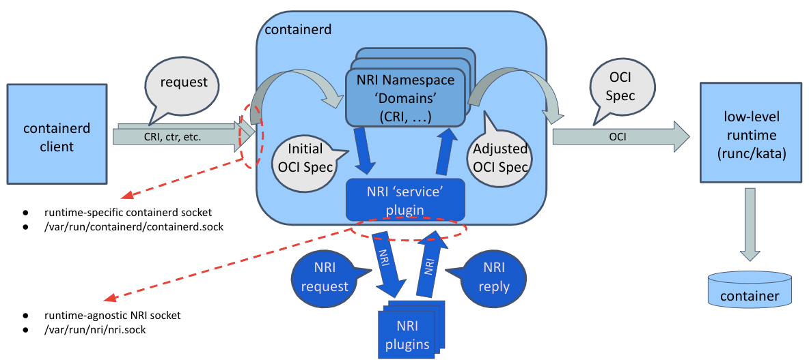

# NRI Support In Containerd

## Node Resource Interface

NRI, the Node Resource Interface, is a common framework for plugging
extensions into OCI-compatible container runtimes. It provides basic
mechanisms for plugins to track the state of containers and to make
limited changes to their configuration.

NRI itself is agnostic to the internal implementation details of any
container runtime. It provides an adaptation library which runtimes
use to integrate to and interact with NRI and plugins. In principle
any NRI plugin should be able to work with NRI-enabled runtimes.

For a detailed description of NRI and its capabilities please take a
look at the [NRI repository](https://github.com/containerd/nri).

## Containerd NRI Integration

<details>
<summary>see the containerd/NRI integration diagram</summary>

</details>

NRI support in containerd is split into two parts both logically and
physically. These parts are a common plugin (/nri/*) to integrate to
NRI and CRI-specific bits (/pkg/cri/server/nri-api) which convert
data between the runtime-agnostic NRI representation and the internal
representation of the CRI plugin.

### Containerd NRI Plugin

The containerd common NRI plugin implements the core logic of integrating
to and interacting with NRI. However, it does this without any knowledge
about the internal representation of containers or pods within containerd.
It defines an additional interface, Domain, which is used whenever the
internal representation of a container or pod needs to be translated to
the runtime agnostic NRI one, or when a configuration change requested by
an external NRI plugin needs to be applied to a container within containerd. `Domain` can be considered as a short-cut name for Domain-Namespace as Domain implements the functions the generic NRI interface needs to deal with pods and containers from a particular containerd namespace. As a reminder, containerd namespaces isolate state between clients of containerd. E.g. "k8s.io" for the kubernetes CRI clients, "moby" for docker clients, ... and "containerd" as the default for containerd/ctr.

### NRI Support for CRI Containers

The containerd CRI plugin registers itself as an above mentioned NRI
Domain for the "k8s.io" namespace, to allow container configuration to be customized by external
NRI plugins. Currently this Domain interface is only implemented for
the original CRI `pkg/cri/server` implementation. Implementing it for
the more recent experimental `pkg/cri/sbserver` implementation is on
the TODO list.

### NRI Support for Other Container 'Domains'

The main reason for this split of functionality is to allow
 NRI plugins for other types of sandboxes and for other container clients other than just for CRI containers in the "k8s.io" namespace.

## Enabling NRI Support in Containerd

Enabling and disabling NRI support in containerd happens by enabling or
disabling the common containerd NRI plugin. The plugin, and consequently
NRI functionality, is disabled by default. It can be enabled by editing
the `[plugins."io.containerd.nri.v1.nri"]` section in the containerd
configuration file, which by default is `/etc/containerd/config.toml`,
and changing `disable = true` to `disable = false`. Once enabled, the
NRI section should look something like this:

```toml
  [plugins."io.containerd.nri.v1.nri"]
    # Enable NRI support in containerd.
    disable = false
    # Allow connections from externally launched NRI plugins.
    disable_connections = false
    # plugin_config_path is the directory to search for plugin-specific configuration.
    plugin_config_path = "/etc/nri/conf.d"
    # plugin_path is the directory to search for plugins to launch on startup.
    plugin_path = "/opt/nri/plugins"
    # plugin_registration_timeout is the timeout for a plugin to register after connection.
    plugin_registration_timeout = "5s"
    # plugin_requst_timeout is the timeout for a plugin to handle an event/request.
    plugin_request_timeout = "2s"
    # socket_path is the path of the NRI socket to create for plugins to connect to.
    socket_path = "/var/run/nri/nri.sock"
```

There are two ways how an NRI plugin can be started. Plugins can be
pre-registered in which case they are automatically started when the NRI
adaptation is instantiated (or in our case when containerd is started).
Plugins can also be started by external means, for instance by systemd.

Pre-registering a plugin happens by placing a symbolic link to the plugin
executable into a well-known NRI-specific directory, `/opt/nri/plugins`
by default. A pre-registered plugin is started with a socket pre-connected
to NRI. Externally launched plugins connect to a well-known NRI-specific
socket, `/var/run/nri/nri.sock` by default, to register themselves. The only
difference between pre-registered and externally launched plugins is how
they get started and connected to NRI. Once a connection is established
all plugins are identical.

NRI can be configured to disable connections from externally launched
plugins, in which case the well-known socket is not created at all. The
configuration fragment shown above ensures that external connections are
enabled regardless of the built-in NRI defaults. This is convenient for
testing as it allows one to connect, disconnect and reconnect plugins at
any time.

Note that you can't run two NRI-enabled runtimes on a single node with the
same default socket configuration. You need to either disable NRI or change
the NRI socket path in one of the runtimes.

## Testing NRI Support in Containerd

You can verify that NRI integration is properly enabled and functional by
configuring containerd and NRI as described above, taking the NRI
logger plugin from the [NRI repository](https://github.com/containerd/nri/tree/main/plugins/logger)
on github, compiling it and starting it up.

```bash
git clone https://github.com/containerd/nri
cd nri
make
./build/bin/logger -idx 00
```

You should see the logger plugin receiving receiving a list of existing pods
and containers. If you then create or remove further pods and containers
using crictl or kubectl you should see detailed logs of the corresponding NRI
events printed by the logger.

## NRI Compatibility With v0.1.0 Plugins

You can enable backward compatibility with NRI v0.1.0 plugins using the
[v010-adapter plugin](https://github.com/containerd/nri/tree/main/plugins/v010-adapter).

```bash
git clone https://github.com/containerd/nri
cd nri
make
sudo cp build/bin/v010-adapter /usr/local/bin
sudo mkdir -p /opt/nri/plugins
sudo ln -s /usr/local/bin/v010-adapter /opt/nri/plugins/00-v010-adapter
```
