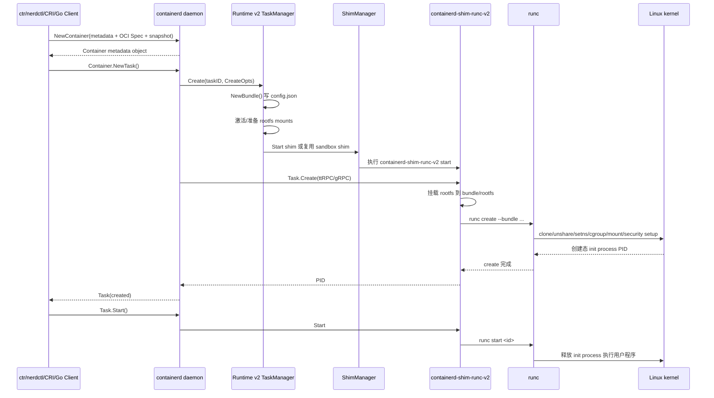
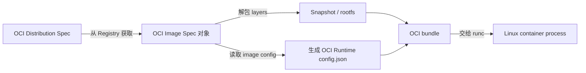
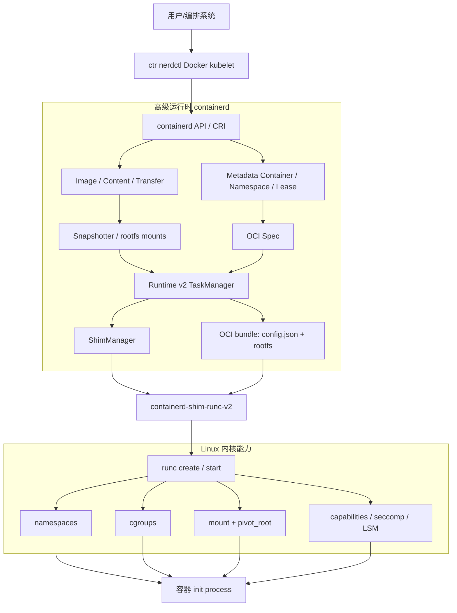

# 《containerd 原理剖析与实战》第 2 章伴读

> **适配版本：containerd 2.2.5**
> **对应原书章节：第 2 章 初识容器运行时**
> **源码基线：用户提供的 `containerd-2.2.5` 源码包**

---

## 阅读说明

这一章不急着进入 containerd 的插件初始化、镜像拉取、Snapshotter 或 CRI 细节，而是先建立一个不会过时的底层模型：

> **容器不是一种特殊进程，而是一个普通 Linux 进程，只是它看到的系统视图被 namespace 隔离、可使用的资源被 cgroup 约束、根文件系统被重新组织，并附加了 capabilities、seccomp、LSM 等安全限制。**

在 containerd 2.2.5 中，完整执行链可以先压缩成一句话：

```text
客户端/CRI
  → containerd 管理镜像、快照、元数据和 OCI Spec
  → Runtime v2 TaskManager 创建 OCI bundle
  → containerd 启动或复用 containerd-shim-runc-v2
  → shim 调用 runc create / start
  → runc 通过 Linux 内核接口创建容器进程
```

本文使用三类标记：

- **源码事实**：可以直接在 containerd 2.2.5 源码中定位。
- **Linux 原理**：来自 Linux namespace、cgroup、mount 等通用机制。
- **阅读提醒**：原书基于 1.7.1，阅读时容易产生版本偏差的地方。

---

## 2.1 容器技术的发展史

### 2.1.1 容器技术解决的根本矛盾

虚拟机通过虚拟硬件运行完整 Guest OS，隔离边界清楚，但启动慢、内存和磁盘开销大。

传统进程启动快、开销小，却默认共享宿主机的：

- 进程编号空间；
- 网络协议栈；
- 挂载点；
- 主机名；
- IPC 对象；
- 用户 ID；
- CPU、内存和 I/O 资源。

容器技术的核心目标，是在不启动第二个内核的前提下，让一组进程获得“像独立操作系统一样”的运行视图。

所以，容器技术的演化并不是某一天突然发明了“容器”，而是多个 Linux 能力逐渐拼合的结果：

```text
chroot
  ↓ 只改变文件路径视图，不足以完成隔离
Linux namespaces
  ↓ 隔离进程、网络、挂载、IPC、主机名等系统视图
cgroups
  ↓ 统计、限制和控制 CPU、内存、PIDs、I/O 等资源
Capabilities / seccomp / SELinux / AppArmor
  ↓ 缩小 root 权限和系统调用攻击面
镜像分层与仓库协议
  ↓ 解决应用交付、复用和分发问题
OCI 标准
  ↓ 统一镜像格式、运行时配置和仓库交互
runc + containerd + CRI
  ↓ 形成低级运行时、高级运行时、编排接口的分层体系
```

### 2.1.2 从“隔离进程”到“工业化容器平台”

可以把容器技术分成四个阶段理解。

#### 第一阶段：操作系统提供隔离原语

这一阶段主要解决“进程能看到什么”和“进程能使用多少资源”：

- `chroot` 改变根目录视图；
- namespace 隔离系统资源视图；
- cgroup 对资源进行统计、限额和控制；
- capabilities 将传统 root 的全能权限拆分；
- seccomp 限制系统调用；
- SELinux、AppArmor 提供强制访问控制。

这些都是内核能力，单独一个都不等于完整容器。

#### 第二阶段：LXC 等工具把内核能力组合起来

工具开始负责：

- 创建 namespace；
- 设置 cgroup；
- 准备 rootfs；
- 配置网络；
- 启动容器 init 进程；
- 清理资源。

此时已经能够运行“系统容器”，但镜像构建、分发、版本管理和开发者体验仍不统一。

#### 第三阶段：Docker 将容器变成应用交付方式

Docker 真正改变行业的地方，不只是“能启动隔离进程”，而是把下面这些能力组合成完整产品：

- Dockerfile；
- 分层镜像；
- Registry；
- 统一 CLI；
- 可重复构建；
- 可移植的应用交付模型。

容器由一种 Linux 隔离技术，变成了一种软件交付标准。

#### 第四阶段：OCI、runc、containerd、CRI 分层

随着生态扩大，行业需要拆分职责：

```text
Kubernetes / Docker / nerdctl / ctr
            │
            ▼
高级运行时：containerd、CRI-O
负责镜像、快照、元数据、生命周期、运行时选择
            │
            ▼
运行时适配/监督：shim
负责长生命周期通信、I/O、事件、进程回收
            │
            ▼
低级运行时：runc、crun 等
负责依据 OCI config.json 操作 Linux 内核
            │
            ▼
Linux kernel
namespace / cgroup / mount / capability / seccomp / LSM
```

这套分层很重要，因为它解释了一个常见疑问：

> containerd 和 runc 都被叫作“容器运行时”，为什么两者同时存在？

原因是“容器运行时”有广义和狭义两种用法：

- 广义：能管理容器完整生命周期的系统，例如 containerd；
- 狭义：把 OCI bundle 变成真实进程的执行器，例如 runc。

### 2.1.3 containerd 2.2.5 相比原书 1.7.1 的时代背景变化

原书基于 1.7.1，而 2.2.5 已经站在 Runtime v2 完全取代 Runtime v1 之后。

| 观察点 | 1.7.1 阅读背景 | containerd 2.2.5 |
|---|---|---|
| Go module | 老代码常使用 `github.com/containerd/containerd` | 模块为 `github.com/containerd/containerd/v2` |
| Go 版本 | 旧工具链 | `go.mod` 声明 Go 1.25.0 |
| daemon 配置 | 常见 `version = 2` | 当前最高配置版本为 3 |
| Runtime v1 | 仍能看到大量兼容代码和文档 | `io.containerd.runtime.v1.linux`、`io.containerd.runc.v1` 已移除 |
| 默认 Linux Runtime | `io.containerd.runc.v2` | 仍为 `io.containerd.runc.v2` |
| OCI Runtime Spec | 较早版本 | 源码依赖 `runtime-spec v1.3.0` |
| OCI Image Spec | 较早版本 | 源码依赖 `image-spec v1.1.1` |
| runc 测试基线 | 旧版 runc | `script/setup/runc-version` 为 `v1.3.6` |
| Sandbox | CRI 中已有 PodSandbox，但架构仍在演进 | Sandbox service 已稳定，Sandboxed CRI 默认启用 |
| shim 分组 | 重点通常是一容器一 shim 的理解 | runc v2 shim 支持按 sandbox ID 等标签复用，一个 shim 可服务一个 Pod 内多个容器 |

**源码定位：**

- `go.mod:1-3, 55-58`
- `version/version.go:27-41`
- `defaults/defaults_linux.go:27-28`
- `docs/containerd-2.0.md:13-37, 127-163`
- `script/setup/runc-version:1`

---

## 2.2 容器 Linux 基础

## 2.2.1 容器是如何运行的

### 2.2.1.1 一个容器实际由什么组成

一个 Linux 容器至少包含以下要素：

```text
容器进程
├── namespace：决定它看见什么
├── cgroup：决定它能使用多少资源
├── rootfs：决定它看见哪棵文件系统树
├── mount：把 proc、sysfs、dev、配置文件和数据卷挂进去
├── credentials：UID/GID、capabilities、no_new_privileges
├── syscall policy：seccomp
├── LSM policy：SELinux / AppArmor
└── lifecycle supervisor：shim / runtime / containerd
```

其中：

- namespace 解决“视图隔离”；
- cgroup 解决“资源治理”；
- rootfs 和 mount namespace 解决“文件系统环境”；
- capabilities、seccomp、LSM 解决“权限和攻击面”；
- containerd、shim、runc 解决“如何可靠地创建、启动、监控和删除进程”。

### 2.2.1.2 镜像、Container、Task、Process 不要混为一谈

containerd 的对象模型与 Docker CLI 的日常用语并不完全相同。

#### Image

镜像是内容寻址的元数据和文件系统层集合。它本身不运行。

#### Snapshot

镜像层解包后，由 Snapshotter 组合成可挂载的 rootfs。运行容器通常需要一个可写快照层。

#### Container

在 containerd 中，`Container` 首先是**元数据对象**，可关联：

- OCI Spec；
- Image 引用；
- Snapshotter 和 Snapshot key；
- Runtime 名称和参数；
- labels、extensions、sandbox ID。

源码 `client.Client.NewContainer()` 最终调用 `ContainerService().Create()` 写入元数据，并不会直接启动 Linux 进程。

```go
// client/client.go:338-377
func (c *Client) NewContainer(ctx context.Context, id string,
    opts ...NewContainerOpts) (Container, error) {

    container := containers.Container{
        ID: id,
        Runtime: containers.RuntimeInfo{
            Name: runtime,
        },
    }
    // 应用镜像、快照、OCI Spec、Runtime 等选项
    for _, o := range opts {
        if err := o(ctx, c, &container); err != nil {
            return nil, err
        }
    }
    r, err := c.ContainerService().Create(ctx, container)
    // 此处创建的是 metadata container
    ...
}
```

#### Task

`Task` 才是 containerd 中的可执行对象。创建 Task 会：

- 获取并准备 rootfs mount；
- 读取 Container 中保存的 OCI Spec；
- 创建 OCI bundle；
- 启动或复用 shim；
- 调用低级运行时的 `create`；
- 获得容器 init 进程 PID。

#### Process

一个 Task 至少有一个 init process，还可以通过 `exec` 创建额外进程。

因此可以记住：

```text
Image  = 交付内容
Container = 持久元数据定义
Task = 运行时实例
Process = Task 内的具体 Linux 进程
```

### 2.2.1.3 containerd 2.2.5 的真实创建链路

以使用默认 `io.containerd.runc.v2` 的 Go Client 或 `ctr run` 为例，核心调用链是：



#### 第一段：创建 OCI bundle

`core/runtime/v2/task_manager.go:153-218`：

1. `NewBundle()`；
2. 激活 rootfs mount；
3. 启动或找到 shim；
4. 调用 `shimTask.Create()`。

`core/runtime/v2/bundle.go:46-115` 的 `NewBundle()` 创建 bundle 目录并写入其中三项：

```text
<state>/io.containerd.runtime.v2.task/<namespace>/<container-id>/
├── config.json                    ← bundle.go 写入（oci.ConfigFilename）
├── rootfs/                        ← bundle.go 创建
├── work -> <persistent-work-dir>  ← bundle.go 建立符号链接
```

随后在 shim 启动与容器创建过程中，bundle 目录还会补充以下文件（创建者并非 bundle.go）：

```text
├── bootstrap.json     ← core/runtime/v2/binary.go、shim_manager.go 写入
├── shim-binary-path   ← core/runtime/v2/binary.go 写入
├── options.json       ← containerd-shim-runc-v2/runc/container.go（WriteOptions）写入
└── runtime            ← containerd-shim-runc-v2/runc/container.go（WriteRuntime）写入
```

默认 Linux state 根目录是 `/run/containerd`，因此常见 bundle 路径类似：

```text
/run/containerd/io.containerd.runtime.v2.task/default/demo/
```

但实际路径受 `config.toml` 的 `state` 配置和 namespace 影响，不能写死。

#### 第二段：shim 挂载 rootfs 并调用 runc create

`cmd/containerd-shim-runc-v2/runc/container.go:46-154`：

```go
func NewContainer(ctx context.Context, platform stdio.Platform,
    r *task.CreateTaskRequest) (*Container, error) {

    rootfs := filepath.Join(r.Bundle, "rootfs")
    mount.All(mounts, rootfs)

    p, err := newInit(...)
    if err := p.Create(ctx, config); err != nil {
        return nil, err
    }
    ...
}
```

继续进入 `cmd/containerd-shim-runc-v2/process/init.go:109-180`：

```go
opts := &runc.CreateOpts{
    PidFile:      pidFile.Path(),
    NoPivot:      p.NoPivotRoot,
    NoNewKeyring: p.NoNewKeyring,
}

if err := p.runtime.Create(ctx, r.ID, r.Bundle, opts); err != nil {
    return p.runtimeError(err, "OCI runtime create failed")
}
```

这里调用的是 `runc create`，而不是直接执行用户程序。

#### 第三段：Task.Start 对应 runc start

客户端调用：

```text
client/task.go:243-261
  → TaskService.Start
plugins/services/tasks/local.go:274-295
  → runtime.Process.Start
core/runtime/v2/shim.go:688-695
  → shim Task.Start RPC
cmd/containerd-shim-runc-v2/task/service.go:298-353
  → Container.Start
cmd/containerd-shim-runc-v2/process/init.go:264-275
  → runc start
```

`createdState.Start()` 在成功后把状态转为 `running`：

```go
// cmd/containerd-shim-runc-v2/process/init_state.go:78-83
func (s *createdState) Start(ctx context.Context) error {
    if err := s.p.start(ctx); err != nil {
        return err
    }
    return s.transition("running")
}
```

#### 一个容易被旧资料误导的点

`NewTask()` 完成后已经有 PID，但用户程序尚未真正开始执行；Task 处于 `created` 状态。只有 `Task.Start()` 后，runc 才让容器 init 进程进入 `running`。

源码在 `cmd/containerd-shim-runc-v2/task/service.go:254` 明确说明：

> `runc.Create(init)` 后，容器 cgroup 中已经存在一个 paused init process。

所以：

```text
runc create ≠ 用户程序已运行
runc start  = 用户程序真正开始执行
```

这也是 OCI Runtime 生命周期将 `create` 和 `start` 分开的意义：runtime 可以在两阶段之间处理必要的运行时准备。不要由此倒推出所有平台都在该窗口配置网络：containerd 2.2.5 默认 Sandboxed CRI 会在创建并启动 sandbox task 前为预先创建的 netns 调用 CNI，具体时序见第 4、5 章。

---

## 2.2.2 namespace

### 2.2.2.1 namespace 的本质

namespace 不是虚拟机，也不是复制一套内核对象，而是让不同进程在访问内核资源时获得不同的“视图”。

可以把它类比为数据库中的不同视图：底层仍是同一个内核，但查询结果不同。

```text
同一个 Linux kernel
├── 进程 A → PID namespace A / mount namespace A / net namespace A
└── 进程 B → PID namespace B / mount namespace B / net namespace B
```

### 2.2.2.2 OCI Runtime Spec 1.3.0 支持的 namespace 类型

containerd 2.2.5 vendored 的 OCI Runtime Spec 1.3.0 定义了八种 Linux namespace：

| OCI 类型 | Linux 含义 | 主要隔离对象 |
|---|---|---|
| `pid` | PID namespace | PID 编号、进程树视图 |
| `network` | Network namespace | 网卡、路由、端口、iptables、socket 网络栈 |
| `mount` | Mount namespace | 挂载点和挂载传播关系 |
| `ipc` | IPC namespace | System V IPC、POSIX 消息队列 |
| `uts` | UTS namespace | hostname、domainname |
| `user` | User namespace | UID/GID 映射、namespace 内 capabilities |
| `cgroup` | Cgroup namespace | `/proc/*/cgroup` 等看到的 cgroup 根视图 |
| `time` | Time namespace | 部分系统时钟偏移视图 |

源码：

```text
vendor/github.com/opencontainers/runtime-spec/specs-go/config.go:264-303
```

#### containerd 默认创建哪些 namespace

`pkg/oci/spec.go:137-155`：

```go
func defaultUnixNamespaces() []specs.LinuxNamespace {
    return []specs.LinuxNamespace{
        {Type: specs.PIDNamespace},
        {Type: specs.IPCNamespace},
        {Type: specs.UTSNamespace},
        {Type: specs.MountNamespace},
        {Type: specs.NetworkNamespace},
    }
}
```

因此默认 OCI Spec 包含：

```text
pid + ipc + uts + mount + network
```

默认没有自动加入：

```text
user + cgroup + time
```

这不代表 containerd 不支持它们，而是它们需要显式配置或由 CRI、客户端、RuntimeClass 等上层逻辑决定。

### 2.2.2.3 “创建新 namespace”“加入现有 namespace”“使用宿主 namespace”

OCI 中 `LinuxNamespace` 有两个关键字段：

```go
type LinuxNamespace struct {
    Type LinuxNamespaceType `json:"type"`
    Path string             `json:"path,omitempty"`
}
```

语义是：

- `Path` 为空：运行时创建一个新的该类型 namespace；
- `Path` 非空：加入路径指向的已有 namespace；
- Spec 中根本没有该类型：使用调用进程继承到的宿主 namespace。

#### 加入已有 namespace

containerd 的 `oci.WithLinuxNamespace()` 会替换或追加 namespace：

```go
// pkg/oci/spec_opts.go:340-353
func WithLinuxNamespace(ns specs.LinuxNamespace) SpecOpts {
    return func(..., s *Spec) error {
        for i, n := range s.Linux.Namespaces {
            if n.Type == ns.Type {
                s.Linux.Namespaces[i] = ns
                return nil
            }
        }
        s.Linux.Namespaces = append(s.Linux.Namespaces, ns)
        return nil
    }
}
```

例如：

```json
{
  "type": "network",
  "path": "/proc/1234/ns/net"
}
```

表示容器加入 PID 1234 的 network namespace。

`ctr run --with-ns network:/path/to/netns` 最终就是调用这个 SpecOpt。源码：

```text
cmd/ctr/commands/run/run_unix.go:339-352
```

#### 使用宿主 namespace

`oci.WithHostNamespace()` 的实现不是填入 `/proc/1/ns/...`，而是从 OCI Spec 中删除对应 namespace 项：

```go
// pkg/oci/spec_opts.go:326-338
func WithHostNamespace(ns specs.LinuxNamespaceType) SpecOpts {
    return func(..., s *Spec) error {
        for i, n := range s.Linux.Namespaces {
            if n.Type == ns {
                s.Linux.Namespaces = append(
                    s.Linux.Namespaces[:i],
                    s.Linux.Namespaces[i+1:]...,
                )
                return nil
            }
        }
        return nil
    }
}
```

例如 `ctr run --net-host` 会删除 network namespace，并附加宿主机的 hosts、resolv.conf 等配置：

```text
cmd/ctr/commands/run/run_unix.go:243-253
```

### 2.2.2.4 各 namespace 的关键理解

#### PID namespace

容器内 PID 1 是该 PID namespace 的第一个进程，但它在宿主机上仍有另一个真实 PID。

```text
容器视角：PID 1
宿主视角：PID 43210
```

PID namespace 是层级结构：父 namespace 可以看到子 namespace 中的进程，子 namespace 看不到父 namespace 的其他进程。

容器 PID 1 还承担特殊职责，例如回收孤儿进程、处理信号。shim 也会承担宿主侧的子进程监督和回收职责，两者不是同一个概念。

#### Network namespace

每个 network namespace 拥有独立的：

- loopback；
- 网络接口；
- IP 地址；
- 路由表；
- 端口空间；
- netfilter 状态。

一个新 network namespace 默认只有未启用的 loopback，不会凭空获得外网能力。CNI、nerdctl 或其他网络组件需要把 veth、路由和 IP 配置进去。

**阅读提醒：containerd 核心运行时负责运行容器，但通用 containerd API 本身并不等同于 Docker 网络管理器。Kubernetes 场景下网络主要由 CRI 插件配合 CNI 完成。**

#### Mount namespace

它让容器拥有不同的挂载树。rootfs、`/proc`、`/sys`、`/dev`、Secret、ConfigMap、数据卷都依赖 mount namespace。

Mount namespace 隔离的是“挂载关系”，不是底层块设备内容本身。是否会把新挂载传播给其他 namespace，还受到 shared、slave、private 等 mount propagation 属性影响。

#### UTS namespace

主要隔离 hostname 和 NIS domain name。容器修改 hostname 不应影响宿主机。

#### IPC namespace

隔离 System V IPC、POSIX message queue 等 IPC 对象，但不会隔离所有进程通信方式。Unix socket、共享文件、网络 socket 是否隔离，还取决于 mount 和 network namespace 等其他机制。

#### User namespace

User namespace 允许：

```text
容器内 UID 0  → 宿主机 UID 100000
```

因此“容器内 root”不一定是“宿主机 root”。containerd 通过 OCI Spec 的 `UIDMappings`、`GIDMappings` 和 user namespace 描述映射。

`pkg/oci/spec_opts.go:547-567` 的 `WithUserNamespace()` 会：

1. 确保 OCI Spec 中存在 `user` namespace；
2. 追加 UID mappings；
3. 追加 GID mappings。

containerd 2.x 的 CRI 已支持 Kubernetes Pod user namespace，但是否可用还取决于 kubelet、内核、runc、文件系统和集群配置。

#### Cgroup namespace

它只隔离进程看到的 cgroup 路径视图，并不负责限制 CPU 或内存。资源限制仍由 cgroup controller 完成。

不要把：

```text
cgroup namespace
```

和：

```text
cgroup resource control
```

混为一谈。

#### Time namespace

Time namespace 可以为部分时钟提供偏移视图，但不是让每个容器拥有完全独立的现实时间系统。是否可用取决于内核和 runtime 支持。

### 2.2.2.5 Linux namespace 与 containerd namespace 是两回事

containerd 也有一个叫 namespace 的概念，例如：

```bash
ctr -n k8s.io containers ls
ctr -n default containers ls
```

这里的 `k8s.io`、`default` 是 containerd 的逻辑租户 namespace，用于隔离元数据对象，不是 Linux namespace。

| 名称 | 所在层 | 作用 |
|---|---|---|
| Linux namespace | 内核 | 隔离进程看到的 PID、网络、挂载等视图 |
| containerd namespace | containerd API/metadata | 隔离不同客户端的容器、镜像、任务、租约等对象名和元数据 |

containerd namespace 通过 context 传播：

```go
ctx = namespaces.WithNamespace(ctx, "k8s.io")
```

源码：

```text
pkg/namespaces/context.go
cmd/ctr/commands/client.go:44
```

### 2.2.2.6 实验：观察 namespace

启动一个长时间运行的容器：

```bash
ctr -n default run -d --rm \
  docker.io/library/alpine:latest ns-demo sleep 3600
```

取得宿主 PID：

```bash
pid=$(ctr -n default tasks ls | awk '$1=="ns-demo" {print $2}')
echo "$pid"
```

观察 namespace inode：

```bash
for ns in mnt uts ipc net pid user cgroup time; do
  printf '%-8s ' "$ns"
  readlink "/proc/$pid/ns/$ns" 2>/dev/null || echo unsupported
done
```

对比宿主当前 shell：

```bash
for ns in mnt uts ipc net pid user cgroup time; do
  printf '%-8s host=%-24s container=%s\n' \
    "$ns" \
    "$(readlink /proc/self/ns/$ns 2>/dev/null)" \
    "$(readlink /proc/$pid/ns/$ns 2>/dev/null)"
done
```

进入某个 namespace：

```bash
nsenter -t "$pid" -m -u -i -n -p --fork sh
```

清理：

```bash
ctr -n default tasks kill ns-demo
ctr -n default tasks delete ns-demo
ctr -n default containers delete ns-demo
```

---

## 2.2.3 Cgroups

### 2.2.3.1 cgroup 解决的不是“看不见”，而是“用多少”

namespace 让进程看不到或看到不同的资源视图，但它并不能防止一个容器耗尽宿主机所有 CPU、内存或 PID。

cgroup 的职责是：

- **Accounting**：统计资源使用；
- **Limiting**：设置硬限制或软限制；
- **Prioritization**：设置竞争权重；
- **Control**：冻结、迁移、组织进程；
- **Eventing**：产生 OOM、压力等事件。

一句话区分：

```text
namespace：你看见什么
cgroup：你能用多少
```

### 2.2.3.2 cgroup v1 与 v2

#### cgroup v1

不同 controller 可以有不同层级：

```text
/sys/fs/cgroup/cpu/...
/sys/fs/cgroup/memory/...
/sys/fs/cgroup/pids/...
```

优点是历史兼容广，缺点是层级分散、接口不统一、委派复杂。

#### cgroup v2

所有 controller 使用统一层级：

```text
/sys/fs/cgroup/<path>/
├── cgroup.procs
├── cpu.max
├── cpu.weight
├── memory.max
├── memory.current
├── pids.max
└── io.max
```

containerd 2.2.5 同时保留 cgroup v1/v2 适配，源码依赖：

```text
github.com/containerd/cgroups/v3 v3.1.2
```

shim 在创建容器后，会根据真实进程加载 v1 或 v2 cgroup，并启动 OOM 监控：

```text
cmd/containerd-shim-runc-v2/task/service.go:254-279
```

### 2.2.3.3 OCI Spec 如何描述 cgroup

OCI Runtime Spec 中有两个关键位置：

```json
{
  "linux": {
    "cgroupsPath": "...",
    "resources": {
      "cpu": {},
      "memory": {},
      "pids": {},
      "blockIO": {},
      "devices": []
    }
  }
}
```

#### `linux.cgroupsPath`

表示容器要创建或加入的 cgroup 路径。

containerd 的 `oci.WithCgroup(path)` 只是把路径写进 Spec：

```go
// pkg/oci/spec_opts.go:570-577
func WithCgroup(path string) SpecOpts {
    return func(..., s *Spec) error {
        s.Linux.CgroupsPath = path
        return nil
    }
}
```

`WithNamespacedCgroup()` 则使用 containerd namespace 和 container ID 组合路径：

```text
/<containerd-namespace>/<container-id>
```

源码：`pkg/oci/spec_opts.go:579-591`。

#### `linux.resources`

表示具体限制值。例如：

```json
{
  "linux": {
    "resources": {
      "cpu": {
        "quota": 50000,
        "period": 100000,
        "cpus": "0-1"
      },
      "memory": {
        "limit": 536870912
      },
      "pids": {
        "limit": 256
      }
    }
  }
}
```

这表示：

- 每 100000 微秒周期最多使用 50000 微秒 CPU，约等于 0.5 核硬上限；
- 允许调度到 CPU 0-1；
- 内存上限 512 MiB；
- 最多 256 个进程/线程计数项。

注意：具体映射到 cgroup v1 还是 v2 文件，由 runc 和 cgroup 库根据宿主环境完成。OCI Spec 描述的是跨实现的抽象，不等于某一个 `/sys/fs/cgroup` 文件名。

### 2.2.3.4 containerd 如何生成资源字段

#### CPU 核数参数

`ctr run --cpus` 的处理源码：

```go
// cmd/ctr/commands/run/run_unix.go:306-312
if cpus := cliContext.Float64("cpus"); cpus > 0.0 {
    period := uint64(100000)
    quota := int64(cpus * 100000.0)
    opts = append(opts, oci.WithCPUCFS(quota, period))
}
```

例如：

```text
--cpus 0.5
```

会生成：

```text
quota  = 50000
period = 100000
```

`oci.WithCPUCFS()` 最终写入：

```text
s.Linux.Resources.CPU.Quota
s.Linux.Resources.CPU.Period
```

源码：`pkg/oci/spec_opts.go:1679-1691`。

#### CPU shares、cpuset 和 burst

containerd 2.2.5 的 SpecOpts 还支持：

| SpecOpt | OCI 字段 | 对应 cgroup 文件 | 含义 |
|---|---|---|---|
| `WithCPUShares` | `CPU.Shares` | v1 `cpu.shares` / v2 `cpu.weight` | 相对竞争权重，主要是“忙时怎么分” |
| `WithCPUs` | `CPU.Cpus` | `cpuset.cpus` | 允许使用的 CPU 编号集合 |
| `WithCPUsMems` | `CPU.Mems` | `cpuset.mems` | 允许使用的 NUMA memory nodes |
| `WithCPUCFS` | `CPU.Quota` / `CPU.Period` | v1 `cpu.cfs_quota_us`、`cpu.cfs_period_us` / v2 `cpu.max` | CPU 时间硬上限 |
| `WithCPUBurst` | `CPU.Burst` | 由 runc 按 cgroup 版本映射 | 允许积累的额外 burst CPU 时间 |

“CPU 权重”和“CPU 上限”不是一回事：

```text
shares/weight：发生竞争时的相对优先级
quota/period：即使 CPU 空闲，也不能长期突破的硬配额
cpuset：只能在哪些 CPU 上运行
```

#### Memory

`ctr run --memory-limit` 调用 `oci.WithMemoryLimit()`：

```go
// pkg/oci/spec_opts.go:1448-1475
l := int64(limit)
s.Linux.Resources.Memory.Limit = &l
```

`WithMemorySwap()` 设置 OCI `memory.swap`。需要注意 v1 和 v2 对 swap 字段的底层语义及文件名并不相同，排查时应以当前宿主机的 cgroup 模式和 runc 实际写入为准。

#### PIDs

`WithPidsLimit()` 写入：

```text
s.Linux.Resources.Pids.Limit
```

PIDs controller 限制的通常不只是传统意义的“进程数量”，Linux task/thread 也会消耗计数，因此线程爆炸同样可能触发上限。

#### Block I/O 和设备

`WithBlockIO()` 设置块设备权重和限速；设备访问则由：

```text
Linux.Devices
Linux.Resources.Devices
```

共同描述：

- 前者决定要在容器 `/dev` 中创建什么设备节点；
- 后者决定 cgroup/设备策略允许怎样访问。

在 cgroup v2 中，设备控制实现可能借助 eBPF 等机制，不能简单假设一定存在 v1 的 `devices.allow` 文件。

### 2.2.3.5 systemd cgroup driver 的含义

containerd 的 runc options 中有：

```protobuf
bool systemd_cgroup = 9;
```

源码：`api/types/runc/options/oci.proto:26-27`。

启用后，containerd 将该选项传给 runc，由 runc 使用 systemd 管理 cgroup，而不是直接按 cgroupfs 路径创建。

这影响：

- cgroup 路径格式；
- systemd slice/scope 组织；
- kubelet 与 runtime 的 cgroup driver 一致性；
- 排查时使用 `systemd-cgls` 还是直接查看 cgroupfs。

但无论使用 systemd driver 还是 cgroupfs driver，最终资源约束仍由 Linux cgroup 机制执行。systemd 是管理方式，不是另一套资源隔离内核。

### 2.2.3.6 实验：观察 cgroup v2 限制

先确认模式：

```bash
stat -fc %T /sys/fs/cgroup
```

常见结果：

```text
cgroup2fs  → cgroup v2
```

运行一个受限容器：

```bash
ctr -n default run -d --rm \
  --cpus 0.5 \
  --memory-limit $((256 * 1024 * 1024)) \
  docker.io/library/alpine:latest cg-demo sleep 3600
```

取得 PID 和 cgroup 路径：

```bash
pid=$(ctr -n default tasks ls | awk '$1=="cg-demo" {print $2}')
cat "/proc/$pid/cgroup"
```

cgroup v2 通常会出现：

```text
0::/某个路径
```

读取实际限制：

```bash
cg=$(awk -F: '$1=="0" {print $3}' "/proc/$pid/cgroup")
cat "/sys/fs/cgroup${cg}/cpu.max"
cat "/sys/fs/cgroup${cg}/memory.max"
cat "/sys/fs/cgroup${cg}/memory.current"
cat "/sys/fs/cgroup${cg}/pids.current"
```

应当把 OCI Spec、`/proc/<pid>/cgroup` 和 `/sys/fs/cgroup` 三者串起来观察，而不是只看 CLI 参数。

---

## 2.2.4 chroot 和 pivot_root

### 2.2.4.1 为什么有了 mount namespace 还需要切换根目录

Mount namespace 只是让进程拥有独立挂载树，但进程仍需要确定 `/` 指向哪一个挂载点。

容器 rootfs 一般先被挂载到 bundle 中：

```text
<bundle>/rootfs
```

随后低级运行时需要让容器进程把该目录视为 `/`。

常见机制是：

- `chroot()`；
- `pivot_root()`；
- 在某些特殊情况下使用其他等效挂载切换方案。

### 2.2.4.2 chroot 的语义和局限

`chroot(newroot)` 主要改变进程路径解析时使用的根目录。

直观上：

```text
原来 /etc/passwd → 宿主机 /etc/passwd
chroot 后 /etc/passwd → newroot/etc/passwd
```

但 chroot 本身并不自动完成：

- PID 隔离；
- 网络隔离；
- cgroup 限制；
- mount namespace 隔离；
- capabilities 限制；
- 旧根挂载的彻底脱离。

所以 chroot 不是安全容器边界，只是容器文件系统构造中的一个基础能力。

如果进程拥有足够权限、保留了指向旧根的文件描述符，或者没有配合独立 mount namespace 和正确挂载处理，单纯 chroot 可能无法形成可靠隔离。

### 2.2.4.3 pivot_root 的语义

`pivot_root(new_root, put_old)` 在当前 mount namespace 中交换根挂载：

```text
切换前：/              = 旧根
        /newroot       = 新根挂载

pivot_root 后：/        = 新根
              /put_old = 旧根

随后：卸载并删除 /put_old
```

与单纯 chroot 相比，pivot_root 更适合容器，因为它面向“挂载树根节点的替换”，并可以把旧根从容器 mount namespace 中卸载。

通常要求：

- 已处于合适的 mount namespace；
- `new_root` 是挂载点；
- `put_old` 位于 `new_root` 之下；
- 挂载传播关系经过正确处理。

真正执行这些细节的是 runc/libcontainer，而不是 containerd daemon 自己。

### 2.2.4.4 containerd 2.2.5 如何参与 rootfs 切换

containerd 的职责边界非常清楚：

#### 1. containerd 创建 bundle

`core/runtime/v2/bundle.go` 创建：

```text
config.json
rootfs/
work
```

#### 2. shim 把 Snapshotter 返回的 mounts 挂到 bundle/rootfs

`cmd/containerd-shim-runc-v2/runc/container.go:104-122`：

```go
mount.All(mounts, rootfs)
```

#### 3. shim 把 `NoPivotRoot` 传给 go-runc

`cmd/containerd-shim-runc-v2/process/init.go:137-150`：

```go
opts := &runc.CreateOpts{
    PidFile: pidFile.Path(),
    NoPivot: p.NoPivotRoot,
}
p.runtime.Create(ctx, r.ID, r.Bundle, opts)
```

#### 4. go-runc 生成 `--no-pivot` 参数

`vendor/github.com/containerd/go-runc/runc.go:129-169`：

```go
if o.NoPivot {
    out = append(out, "--no-pivot")
}
```

也就是说：

> containerd 2.2.5 不自己实现 pivot_root；它准备 bundle/rootfs，并把是否禁用 pivot_root 的选项传给 runc。真正采用 pivot_root 还是替代路径，由所使用的 runc 实现决定。

### 2.2.4.5 默认行为

runc options 中：

```protobuf
bool no_pivot_root = 1;
```

默认零值为 `false`，因此正常 Linux 容器默认不会传 `--no-pivot`。

客户端显式使用 `client.WithNoPivotRoot` 时，才设置：

```go
opts.NoPivotRoot = true
```

然后最终转换为：

```text
runc create --no-pivot ...
```

源码：

```text
client/task_opts_unix.go:36-44
api/types/runc/options/oci.proto:7-13
cmd/containerd-shim-runc-v2/runc/container.go:203-225
cmd/containerd-shim-runc-v2/process/init.go:137-150
vendor/github.com/containerd/go-runc/runc.go:129-169
```

**阅读提醒：不要把 `NoPivotRoot` 理解成“不需要 rootfs 隔离”。它只是告诉 runc 不采用默认 pivot_root 路径，替代实现及安全约束仍由 runc 决定。**

### 2.2.4.6 实验：观察容器进程的根目录

```bash
pid=$(ctr -n default tasks ls | awk '$1=="ns-demo" {print $2}')
readlink "/proc/$pid/root"
findmnt -T "/proc/$pid/root"
```

进入其 mount namespace 后查看：

```bash
nsenter -t "$pid" -m sh -c '
  echo "root: $(readlink /proc/self/root)"
  mount | head
  cat /proc/self/mountinfo | head
'
```

需要注意，宿主通过 `/proc/<pid>/root` 观察到的是该进程的根视图；它不等于容器内普通进程能随意反向访问宿主根目录。

---

## 2.3 容器运行时概述

## 2.3.1 什么是容器运行时

### 2.3.1.1 “运行时”这个词为什么容易混乱

在不同语境中，下面这些都可能被叫作 runtime：

- Docker Engine；
- containerd；
- CRI-O；
- containerd-shim-runc-v2；
- runc；
- crun；
- Kata Containers runtime。

它们并不在同一层。

推荐使用以下分层：

```text
编排/用户层
Kubernetes kubelet / Docker / nerdctl / ctr

CRI/API 层
CRI RuntimeService/ImageService / containerd gRPC API

高级运行时
containerd / CRI-O

运行时适配与监督层
containerd shim

低级运行时/运行时引擎
runc / crun / VM runtime engine

内核或虚拟机层
Linux kernel / guest kernel
```

### 2.3.1.2 高级运行时与低级运行时的职责分界

| 能力 | containerd | shim | runc |
|---|---:|---:|---:|
| 镜像拉取和内容存储 | 是 | 否 | 否 |
| Snapshotter 和 rootfs 准备 | 是 | 配合挂载生命周期 | 否 |
| 容器元数据 | 是 | 局部运行状态 | 仅 runtime 状态 |
| 生成 OCI config.json | Client/containerd 体系 | 消费 | 消费 |
| 选择 runtime | 是 | 被选择 | 否 |
| 长生命周期 RPC | 是 | 是 | 否，通常是短命令式进程 |
| `runc create/start/kill/delete` | 间接 | 直接调用 | 实现 |
| namespace/cgroup/mount 设置 | 生成配置 | 传递、准备 rootfs | 真正执行 |
| 进程退出回收和事件转发 | 汇总 | 重点负责 | 不负责长期监督 |
| 守护进程重启后容器继续运行 | 依赖 shim 解耦 | 是 | 容器进程可继续 |

### 2.3.1.3 containerd 2.2.5 的 Runtime v2 模型

`core/runtime/v2/README.md` 对架构的核心表述是：

- containerd daemon 不直接启动容器；
- containerd 准备镜像内容、rootfs 和配置；
- containerd 调用 runtime shim；
- shim 暴露 ttRPC 或 gRPC Task API；
- runc v2 shim 再调用 runc 运行时引擎。

Runtime v2 的关键价值不是“版本号变成 v2”，而是把 runtime integration 收敛成明确的 shim API，使 containerd 与具体执行引擎解耦。

containerd 2.0 已删除 Runtime v1，因此阅读 1.7.1 书籍时，看到以下内容应视为历史背景：

```text
io.containerd.runtime.v1.linux
io.containerd.runc.v1
```

2.2.5 应重点理解：

```text
io.containerd.runc.v2
containerd-shim-runc-v2
Runtime v2 Task API
```

---

## 2.3.2 OCI 规范

### 2.3.2.1 OCI 解决什么问题

没有标准时，一个镜像可能只能被某个引擎识别，一个 runtime 也只能被某个平台调用。

OCI 将容器生态拆成多个标准化边界。最重要的三部分是：

```text
OCI Image Spec
  镜像 manifest、config、layers、mediaType、digest

OCI Runtime Spec
  config.json、bundle、进程、rootfs、mount、namespace、cgroup、安全配置、生命周期

OCI Distribution Spec
  Registry 的 push、pull、manifest/blob 交互协议
```

containerd 2.2.5 的 `go.mod` 明确依赖：

```text
github.com/opencontainers/image-spec   v1.1.1
github.com/opencontainers/runtime-spec v1.3.0
```

### 2.3.2.2 OCI Image Spec

OCI Image Spec 描述“静态交付物”，核心对象包括：

- Image Manifest；
- Image Index；
- Image Configuration；
- Filesystem Layers；
- Descriptor；
- Media Type；
- Digest。

典型关系：

```text
image index（可选，多架构）
  └── manifest
       ├── config descriptor → image config JSON
       └── layer descriptors → tar/gzip/zstd layers
```

Image Config 中记录：

- Entrypoint；
- Cmd；
- Env；
- WorkingDir；
- User；
- rootfs diff IDs；
- history。

containerd 生成 OCI Runtime Spec 时，`oci.WithImageConfig()` 会读取 Image Config，并把：

```text
Entrypoint + Cmd → process.args
Env              → process.env
WorkingDir       → process.cwd
User             → process.user
```

写入运行时配置。

源码：`pkg/oci/spec_opts.go:364-485`。

因此：

```text
OCI Image Config ≠ OCI Runtime config.json
```

前者是镜像中的静态默认值，后者是某一次容器运行的最终配置。containerd 会把镜像默认值和用户参数、CRI 配置、安全策略、资源限制等合并成最终 OCI Runtime Spec。

### 2.3.2.3 OCI Runtime Spec

OCI Runtime Spec 的核心输入是一个 bundle：

```text
bundle/
├── config.json
└── rootfs/
```

`config.json` 的顶层结构在 2.2.5 vendored runtime-spec 中包括：

```go
type Spec struct {
    Version     string
    Process     *Process
    Root        *Root
    Hostname    string
    Domainname  string
    Mounts      []Mount
    Hooks       *Hooks
    Annotations map[string]string
    Linux       *Linux
    Windows     *Windows
    VM          *VM
    ...
}
```

源码：

```text
vendor/github.com/opencontainers/runtime-spec/specs-go/config.go:5-36
```

containerd 默认 Spec 使用当前 vendored runtime-spec 的版本号：

```go
Version: specs.Version
```

在 2.2.5 中该值为 `1.3.0`：

```text
vendor/github.com/opencontainers/runtime-spec/specs-go/version.go:5-18
pkg/oci/spec.go:157-188
```

#### OCI Runtime State

低级运行时通常围绕这些状态和命令工作：

```text
create → created
start  → running
kill   → stopped
delete → 容器被销毁（不再存在；OCI 状态机只有 creating/created/running/stopped，无 deleted 状态）
```

containerd 的 shim 内部也维护了 `createdState`、`runningState`、`pausedState`、`stoppedState` 等状态对象。

这说明 containerd 的 Task 状态机并不是随意设计，而是与 OCI runtime 生命周期相呼应。

### 2.3.2.4 OCI Distribution Spec

Distribution Spec 统一 Registry 客户端与服务端如何：

- 检查 blob 是否存在；
- 上传和下载 blob；
- 获取和推送 manifest；
- 按 digest 校验内容；
- 处理 tag 和 referrers 等对象。

它只定义分发协议，不负责：

- 如何把 layer 挂成 rootfs；
- 如何创建 namespace；
- 如何启动进程。

因此三个规范应当这样串起来：



### 2.3.2.5 OCI 是边界标准，不是完整容器平台

OCI 不规定 Kubernetes Pod、Service、CNI、镜像垃圾回收策略、containerd metadata DB 等高级能力。

OCI 解决的是组件间的契约：

```text
镜像生产者 ↔ 镜像消费者
Registry ↔ Registry client
高级运行时 ↔ 低级运行时
```

containerd 的价值正是在 OCI 标准之上补齐工业化管理能力。

---

## 2.3.3 低级容器运行时

### 2.3.3.1 低级运行时的输入和输出

低级运行时的典型输入：

```text
OCI bundle
├── config.json
└── rootfs
```

输出是：

```text
一个满足配置要求的真实进程及其内核资源
```

它需要完成：

- 创建或加入 namespace；
- 设置 UID/GID、capabilities；
- 创建/加入 cgroup 并写入资源限制；
- 设置 rootfs 和 mounts；
- 应用 seccomp、SELinux、AppArmor；
- 配置 rlimit、sysctl、hostname；
- 执行 hooks；
- 启动用户程序；
- 实现 state、kill、delete、exec、pause、resume 等生命周期命令。

它通常不负责：

- 从 Registry 拉镜像；
- 镜像 tag 管理；
- 内容存储和 GC；
- Snapshotter；
- Kubernetes CRI；
- CNI 网络编排。

### 2.3.3.2 runc 在 containerd 2.2.5 中的位置

默认 Linux runtime 名称：

```text
io.containerd.runc.v2
```

它会被解析为 shim 二进制：

```text
containerd-shim-runc-v2
```

源码 `core/runtime/v2/shim_manager.go:343-419` 会：

1. 接受绝对路径 runtime；或
2. 把 URI 风格名称转换成 shim binary 名；
3. 在固定路径或 `PATH` 中查找。

但 `containerd-shim-runc-v2` 仍不是最终执行 namespace/cgroup 的 runc 本体。

真实关系：

```text
io.containerd.runc.v2
      ↓ runtime 名称
containerd-shim-runc-v2
      ↓ 长生命周期 shim
runc
      ↓ OCI runtime engine
libcontainer / Linux syscalls
```

### 2.3.3.3 为什么 runc create 和 runc start 分开

对于 runc，`runc create` 负责创建容器执行环境，但把 init process 留在 created 状态；`runc start` 才真正执行用户程序。

这一分离使平台能在中间完成：

- 网络配置；
- runtime hook；
- 监控注册；
- 其他启动前操作。

在 containerd 2.2.5 源码中：

```text
NewTask
  → runc create

Task.Start
  → runc start
```

这种两阶段设计是理解默认 runc Task 生命周期的关键。换用其他 Runtime v2 shim 时，Task API 的 create/start 合同仍在，但其内部不必调用 runc。

### 2.3.3.4 runc 是短生命周期工具，shim 是长生命周期监督者

runc 常以命令形式执行：

```bash
runc create <id>
runc start <id>
runc kill <id> SIGTERM
runc delete <id>
```

命令结束后，runc 进程本身可以退出；容器进程仍继续运行。

shim 则通常长期存在，用来：

- 保持 containerd 与 Task API 的连接；
- 管理 stdin/stdout/stderr；
- 作为 subreaper 回收子进程；
- 监听退出和 OOM；
- 发布事件；
- 在 containerd daemon 重启时保持容器运行；
- 在必要时服务一组容器。

`pkg/shim/shim.go:243-247` 会把 shim 设置成 subreaper；这并不意味着 shim 是容器 PID namespace 内的 PID 1，而是宿主侧进程监督机制。

### 2.3.3.5 可替换低级运行时

只要遵循相应 shim API 和运行时契约，containerd 可以接入不同 runtime，例如：

- runc；
- crun；
- Kata Containers 等虚拟机隔离 runtime；
- gVisor 等沙箱 runtime；
- 自定义 Runtime v2 shim。

但“OCI 兼容”不意味着所有实现支持完全相同的扩展特性。containerd 2.2.5 在创建 Task 前会查询和校验 runtime features，避免把 runtime 不认识的关键字段静默忽略：

```text
core/runtime/v2/task_manager.go:211-215
```

---

## 2.3.4 高级容器运行时

### 2.3.4.1 containerd 负责什么

containerd 是面向上层系统嵌入的高级容器运行时。它负责：

```text
镜像与分发
├── Registry resolver / fetch / push
├── content store
├── image metadata
└── transfer service

文件系统
├── snapshotter
├── unpack
├── mount preparation
└── diff

容器元数据
├── Container
├── Namespace
├── Lease
├── Label / Extension
└── metadata DB

运行生命周期
├── Task service
├── Runtime v2 TaskManager
├── ShimManager
├── Events
├── Monitor
└── Restart / Sandbox

平台集成
├── CRI
├── CNI
├── NRI
├── CDI
└── plugins / proxy plugins
```

它不直接用 `clone()`、`pivot_root()` 创建最终容器，而是把这部分委托给 shim + 低级 runtime。

### 2.3.4.2 containerd 的 Smart Client 模型

containerd 源码文档强调“Smart Client”：很多不必放入 daemon 的高级逻辑由客户端库完成，例如：

- 生成 OCI Spec；
- 合并 image config；
- 与 Registry resolver 交互；
- import/export；
- Container 创建选项组合。

因此源码阅读时，不要只盯着 `cmd/containerd` 服务端。大量核心语义在：

```text
client/
pkg/oci/
core/
plugins/
```

例如 `Client.NewContainer()` 在客户端侧构建完整 `containers.Container` 对象，再通过 service 写入 daemon。

### 2.3.4.3 插件化架构

containerd 内部把大量能力做成 plugin：

- content；
- metadata；
- snapshotter；
- differ；
- events；
- leases；
- runtime v2；
- task service；
- CRI；
- transfer；
- sandbox；
- NRI 等。

这种设计的目的不是为了“插件越多越高级”，而是把接口和实现解耦：

```text
containerd core contract
    ├── built-in implementation
    ├── proxy plugin
    └── external binary/runtime shim
```

**阅读提醒：`docs/PLUGINS.md` 中某些示例输出仍展示已经删除的 Runtime v1 和 AUFS 条目，属于历史示例，不能据此判断 2.2.5 实际仍支持它们。判断当前能力应优先看 `docs/containerd-2.0.md`、插件注册源码和实际 `ctr plugins ls`。**

### 2.3.4.4 为什么需要 shim

没有 shim 时，containerd daemon 直接作为所有容器进程的长期父级，会带来几个问题：

1. daemon 升级或重启可能影响所有容器；
2. 不同 runtime 的通信方式难以统一；
3. stdout/stderr、退出事件、OOM 监控、子进程回收全部压在 daemon；
4. 一个 runtime 出现问题可能扩大到整个 daemon；
5. Kubernetes Pod 内多个容器的共享 runtime/sandbox 管理不够灵活。

shim 把“控制面 daemon”和“具体容器进程监督”分开：

```text
containerd 重启
    │
    ├── shim 仍然存在
    ├── 容器进程仍然存在
    └── containerd 启动后重新加载 shim bootstrap 信息
```

`core/runtime/v2/task_manager.go:135-143` 在初始化时调用 `LoadExistingShims()`；bundle 中保存的 `bootstrap.json`、`shim-binary-path` 等信息用于恢复连接。

### 2.3.4.5 containerd 2.2.5 的 shim 分组能力

runc v2 shim manager 会读取 OCI Spec annotations，并按以下标签决定 grouping：

```go
// cmd/containerd-shim-runc-v2/manager/manager_linux.go:62-68
var groupLabels = []string{
    "io.containerd.runc.v2.group",
    "io.kubernetes.cri.sandbox-id",
}
```

如果多个容器具有相同 sandbox ID，可以复用同一个 shim socket。

`manager.Start()` 返回的 bootstrap version 为 3，并在 socket 已存在且可连接时返回已有地址，而不是再启动一个 shim：

```text
cmd/containerd-shim-runc-v2/manager/manager_linux.go:184-283
```

这意味着在 2.2.5 的 Kubernetes 场景中，更准确的理解是：

```text
通常一个 Pod sandbox 对应一个 runc v2 shim，Pod 内多个容器可共享该 shim
```

而不是简单地认为：

```text
永远一个容器一个 shim
```

具体是否分组仍取决于 runtime、annotation、sandbox 架构和 shim API 版本。

### 2.3.4.6 containerd 与 CRI 的关系

Kubernetes kubelet 不直接调用 containerd 的普通 Container API，而是调用 CRI：

```text
kubelet
  → CRI RuntimeService / ImageService
  → containerd CRI plugin
  → containerd internal services
  → sandbox / snapshotter / task / shim / runc
```

CRI plugin 还负责协调：

- PodSandbox；
- CNI 网络；
- runtime handler；
- Kubernetes labels/annotations；
- image pull；
- 容器日志；
- exec/attach/port-forward；
- Pod 级 namespace 和 cgroup 关系。

containerd 2.0 起 Sandboxed CRI 默认启用，Sandbox service 已稳定。阅读原书时，如果仍以“pause container 只是一个特殊普通 container”概括全部架构，会遗漏 2.x 已经强化的 sandbox 一等对象和多容器 runtime 管理模型。

---

## 第 2 章总图



---

## 原书 1.7.1 阅读时需要替换的关键认知

### 1. Runtime v1 内容只作为历史背景

2.2.5 已删除：

```text
io.containerd.runtime.v1.linux
io.containerd.runc.v1
```

主线只看：

```text
io.containerd.runc.v2
Runtime v2 TaskManager
ShimManager
containerd-shim-runc-v2
```

### 2. Go import 路径已经变更

旧代码：

```go
import "github.com/containerd/containerd"
```

2.x 客户端：

```go
import containerd "github.com/containerd/containerd/v2/client"
```

### 3. Container 不等于正在运行的容器

```text
Container = metadata
Task      = runtime instance
Process   = Linux process
```

### 4. NewTask 不等于用户程序已经开始执行

```text
NewTask   → runc create → created + PID
Task.Start → runc start → running
```

### 5. namespace 要区分两层

```text
Linux namespace      → 内核隔离
containerd namespace → API/metadata 多租户
```

### 6. 一个 shim 不再只能机械理解成一个容器

runc v2 shim 可按：

```text
io.containerd.runc.v2.group
io.kubernetes.cri.sandbox-id
```

分组并服务多个容器。

### 7. OCI 版本基线已经更新

containerd 2.2.5 源码依赖：

```text
OCI Runtime Spec 1.3.0
OCI Image Spec   1.1.1
```

不要用 2024 年书籍中固定列出的旧 Spec 字段覆盖当前 vendored 定义。

---

## 建议的源码阅读顺序

为了与本章内容对应，建议按下列顺序阅读，而不是直接跳入 daemon main：

```text
1. 版本与依赖
   go.mod
   version/version.go
   defaults/defaults_linux.go
   script/setup/runc-version

2. OCI 默认配置
   pkg/oci/spec.go
   pkg/oci/spec_opts.go

3. Container 和 Task 概念
   client/client.go
   client/container.go
   client/task.go

4. daemon Task service
   plugins/services/tasks/local.go

5. Runtime v2
   core/runtime/v2/task_manager.go
   core/runtime/v2/shim_manager.go
   core/runtime/v2/bundle.go
   core/runtime/v2/shim.go

6. runc shim
   cmd/containerd-shim-runc-v2/task/service.go
   cmd/containerd-shim-runc-v2/runc/container.go
   cmd/containerd-shim-runc-v2/process/init.go
   cmd/containerd-shim-runc-v2/process/init_state.go

7. shim 启动与分组
   cmd/containerd-shim-runc-v2/manager/manager_linux.go
   pkg/shim/shim.go

8. OCI vendored 定义
   vendor/github.com/opencontainers/runtime-spec/specs-go/config.go
   vendor/github.com/opencontainers/runtime-spec/specs-go/version.go
```

---

## 本章最终结论

1. **容器的本体是 Linux 进程，不是轻量虚拟机。**
2. **namespace 提供视图隔离，cgroup 提供资源治理，两者职责不同。**
3. **rootfs 依靠 mount namespace 和根目录切换构造，chroot 本身不等于安全容器。**
4. **containerd 中 Container 是元数据，Task 才是运行实例。**
5. **containerd 负责高级管理，shim 负责适配和长期监督，runc 负责真正操作内核。**
6. **OCI Image Spec、Runtime Spec、Distribution Spec 分别规范镜像、执行和分发边界。**
7. **containerd 2.2.5 已完全进入 Runtime v2 时代，Runtime v1 只能作为历史知识阅读。**
8. **`NewTask → runc create` 与 `Task.Start → runc start` 的两阶段链路，是理解后续所有源码的主轴。**
