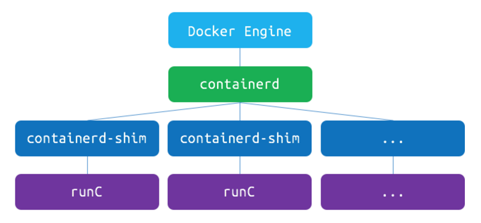
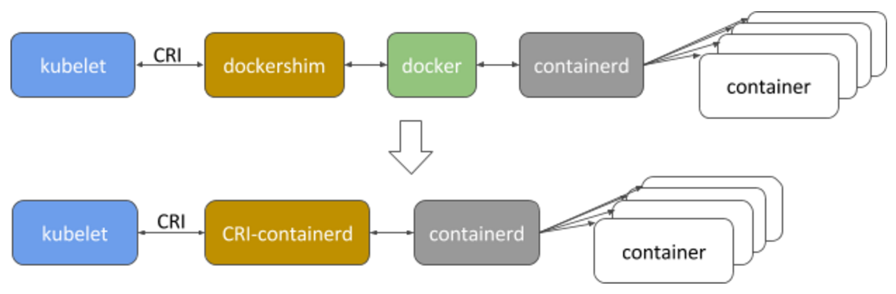

Containerd CRI Integration
=============
Author: Lantao Liu (@random-liu)
## Abstract
This proposal aims to integrate [containerd](https://github.com/containerd/containerd) with Kubelet against the [container runtime interface (CRI)](https://github.com/kubernetes/kubernetes/blob/v1.6.0/pkg/kubelet/api/v1alpha1/runtime/api.proto).
## Background
Containerd is a core container runtime, which provides the minimum set of functionalities to manage the complete container lifecycle of its host system, including container execution and supervision, image distribution and storage, etc.

Containerd was [introduced in Docker 1.11](https://blog.docker.com/2016/04/docker-engine-1-11-runc/), used to manage [runC](https://runc.io/) containers on the node. As shown below, it creates a containerd-shim for each container, and the shim manages the lifecycle of its corresponding container.

In Dec. 2016, Docker Inc. spun it out into a standalone component, and donated it to [CNCF](https://www.cncf.io/) in Mar. 2017.

## Motivation
Containerd is one potential alternative to Docker as the runtime for Kubernetes clusters. *Compared with Docker*, containerd has pros and cons.
### Pros
* **Stability**: Containerd has limited scope and slower feature velocity, which is expected to be more stable.
* **Compatibility**: The scope of containerd aligns with Kubernetes' requirements. It provides the required functionalities and the flexibility for areas like image pulling, networking, volume and logging etc.
* **Performance**:
  * Containerd consumes less resource than Docker at least because it's a subset of Docker;
  * Containerd CRI integration eliminates an extra hop in the stack (as shown below). 
* **Neutral Foundation**: Containerd is part of CNCF now.
### Cons
* **User Adoption**:
  * Ideally, Kubernetes users don't interact with the underlying container runtime directly. However, for the lack of debug toolkits, sometimes users still need to login the node to debug with Docker CLI directly.
  * Containerd provides barebone CLI [ctr](https://github.com/containerd/containerd/tree/main/cmd/ctr) for development and debugging purpose, but it may not be sufficient and necessary. Additionally, presuming these are sufficient and necessary tools, a plan and time would be needed to sufficiently document these CLIs and educate users in their use.
* **Maturity**: The rescoped containerd is pretty new, and it's still under heavy development.
## Goals
* Make sure containerd meets the requirement of Kubernetes, now and into the foreseeable future.
* Implement containerd CRI shim and make sure it provides equivalent functionality, usability and debuggability.
* Improve Kubernetes by taking advantage of the flexibility provided by containerd.
## Design
The following sections discuss the design aspects of the containerd CRI integration. For the purposes of this doc, the containerd CRI integration will be referred to as `CRI-containerd`.
### Container Lifecycle
CRI-containerd relies on containerd to manage container lifecycle.

Ideally, CRI-containerd only needs to do api translation and information reorganization. However, CRI-containerd needs to maintain some metadata because:
* There is a mismatch between container lifecycle of CRI and containerd - containerd only tracks running processes, once the container and it's corresponding containerd-shim exit, the container is no longer visible in the containerd API.
* Some sandbox/container metadata is not provided by containerd, and we can not leverage OCI runtime annotation to store it because of the container lifecycle mismatch, e.g. labels/annotations, `PodSandboxID` of a container, `FinishedAt` timestamp, `ExitCode`, `Mounts` etc.

CRI-containerd should checkpoint these metadata itself or use [containerd metadata service](https://github.com/containerd/containerd/blob/0a5544d8c4dab44dfc682f5ad07f1cd011c0a115/design/plugins.md#core) if available.
### Container Logging
Containerd doesn't provide persistent container log. It redirects container STDIO into different FIFOs.

CRI-containerd should start a goroutine (process/container in the future) to:
* Continuously drain the FIFO;
* Decorate the log line into [CRI-defined format](https://github.com/kubernetes/design-proposals-archive/blob/main/node/kubelet-cri-logging.md#proposed-solution);
* Write the log into [CRI-defined log path](https://github.com/kubernetes/design-proposals-archive/blob/main/node/kubelet-cri-logging.md#proposed-solution).
### Container Streaming
Containerd supports creating a process in the container with `Exec`, and the STDIO is also exposed as FIFOs. Containerd also supports resizing console of a specific process with `Pty`.

CRI-containerd could reuse the [streaming server](https://github.com/kubernetes/kubernetes/blob/release-1.6/pkg/kubelet/server/streaming/server.go), it should implement the [streaming runtime interface](https://github.com/kubernetes/kubernetes/blob/release-1.6/pkg/kubelet/server/streaming/server.go#L61-L65).

For different CRI streaming functions:
* `ExecSync`: CRI-containerd should use `Exec` to create the exec process, collect the stdout/stderr of the process, and wait for the process to terminate.
* `Exec`: CRI-containerd should use `Exec` to create the exec process, create a goroutine (process/container) to redirect streams, and wait for the process to terminate.
* `Attach`: CRI-containerd should create a goroutine (process/container) to read the existing container log to the output, redirect streams of the init process, and wait for any stream to be closed.
* `PortForward`: CRI-containerd could implement this with `socat` and `nsenter`, similar with [current Docker portforward implementation](https://github.com/kubernetes/kubernetes/blob/release-1.6/pkg/kubelet/dockertools/docker_manager.go#L1373-L1428).
### Container Networking
Containerd doesn't provide container networking, but OCI runtime spec supports joining a linux container into an existing network namespace.

CRI-containerd should:
* Create a network namespace for a sandbox;
* Call [network plugin](https://kubernetes.io/docs/concepts/extend-kubernetes/compute-storage-net/network-plugins/) to update the options of the network namespace;
* Let the user containers in the same sandbox share the network namespace.
### Container Metrics
Containerd provides [container cgroup metrics](https://github.com/containerd/containerd/blob/main/docs/historical/reports/2017-03-17.md#metrics), and plans to provide [container writable layer disk usage](https://github.com/containerd/containerd/issues/678).

CRI container metrics api needs to be defined ([#27097](https://github.com/kubernetes/kubernetes/issues/27097)). After that, CRI-containerd should translate containerd container metrics into CRI container metrics.
### Image Management
CRI-containerd relies on containerd to manage images. Containerd should provide all function and information required by CRI, and CRI-containerd only needs to do api translation and information reorganization.

### ImageFS Metrics
Containerd plans to provide [image filesystem metrics](https://github.com/containerd/containerd/issues/678).

CRI image filesystem metrics needs to be defined ([#33048](https://github.com/kubernetes/kubernetes/issues/33048)). After that, we should make sure containerd provides the required metrics, and CRI-containerd should translate containerd image filesystem metrics into CRI image filesystem metrics.
### Out of Scope
Following items are out of the scope of this design, we may address them in future version as enhancement or optimization.
* **Debuggability**: One of the biggest concern of CRI-containerd is debuggability. We should provide equivalent debuggability with Docker CLI through `kubectl`, [`cri-tools`](https://github.com/kubernetes-sigs/cri-tools) or containerd CLI.
* **Built-in CRI support**: The [plugin model](https://github.com/containerd/containerd/blob/main/docs/PLUGINS.md) provided by containerd makes it possible to directly build CRI support into containerd as a plugin, which will eliminate one more hop from the stack. But because of the [limitation of golang plugin](https://github.com/containerd/containerd/issues/563), we have to either maintain our own branch or push CRI plugin upstream.
* **Seccomp**: ([#36997](https://github.com/kubernetes/kubernetes/issues/36997)) Seccomp is supported in OCI runtime spec. However, current seccomp implementation in Kubernetes is experimental and docker specific, the api needs to be defined in CRI first before CRI-containerd implements it.
* **Streaming server authentication**: ([#36666](https://github.com/kubernetes/kubernetes/issues/36666)) CRI-containerd will be out-of-process with Kubelet, so it could not reuse Kubelet authentication. Its streaming server should implement its own authentication mechanism.
* **Move container facilities into pod cgroup**: Container facilities including container image puller, container streaming handler, log handler and containerd-shim serve a specific container. They should be moved to the corresponding pod cgroup, and the overhead introduced by them should be charged to the pod.
* **Log rotation**: ([#42718](https://github.com/kubernetes/kubernetes/issues/42718)) Container log rotation is under design. A function may be added in CRI to signal the runtime to reopen log file. CRI-containerd should implement that function after it is defined.
* **Exec container**: With the flexibility provided by containerd, it is possible to implement `Exec` with a separate container sharing the same rootfs and mount namespace with the original container. The advantage is that the `Exec` container could have it's own sub-cgroup, so that it will not consume the resource of application container and user could specify dedicated resource for it.
* **Advanced image management**: The image management interface in CRI is relatively simple because the requirement of Kubelet image management is not clearly scoped out. In the future, we may want to leverage the flexibility provided by containerd more, e.g. estimate image size before pulling etc.
* ...
## Roadmap and Milestones
### Milestones
#### Kubernetes 1.7 - Q2
* [P0] Basic container lifecycle.
* [P0] Basic image management.
* [P0] Container networking.
* [P1] Container streaming/logging.
* [P2] Container/ImageFS Metrics.

*Test Plan: Each feature added should have unit test and pass its corresponding cri validation test.*
#### Kubernetes 1.8 - Q3
* [P0] Feature complete, pass 100% cri validation test.
* [P0] Integrate CRI-containerd with Kubernetes, and build the e2e/node e2e test framework.
* [P1] Address the debuggability problem.
### Q2 Roadmap
|               Item               | 1/2 Mar. | 2/2 Mar. | 1/2 Apr. | 2/2 Apr. | 1/2 May. | 2/2 May. |
|:--------------------------------:|:--------:|:--------:|:--------:|:--------:|:--------:|:--------:|
|              Survey              |     ✓    |          |          |          |          |          |
|                POC               |          |     ✓    |          |          |          |          |
|             Proposal             |          |          |     ✓    |          |          |          |
|    Containerd Feature Complete   |     ✓    |     ✓    |     ✓    |          |          |          |
|  Runtime Management Integration  |          |          |     ✓    |     ✓    |     ✓    |     ✓    |
|   Image Management Integration   |          |          |          |     ✓    |     ✓    |     ✓    |
| Container Networking Integration |          |          |          |          |     ✓    |     ✓    |
