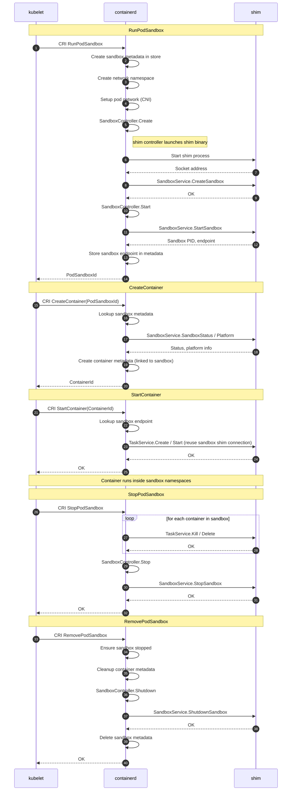

# Sandbox API

The Sandbox API introduces a first class sandbox primitive for managing groups of containers that share resources
and a common lifecycle. It is entirely based on the existing [Runtime v2](../core/runtime/v2/README.md) shim
architecture, extending the shim model with dedicated sandbox lifecycle management.

## Background

In the Runtime v2 model, containerd launches a shim process for each container. The shim exposes a
[`TaskService`](../api/runtime/task/v3/shim.proto) over a ttrpc (or gRPC) socket, and containerd sends
create/start/stop/delete commands over that connection. This works well for individual containers, but breaks down
when containers need to be grouped into a shared execution environment — a sandbox.

In Kubernetes, a Pod is a group of containers that are scheduled together and share resources such as a network
namespace. To implement this, Kubernetes uses a "pause container" — a minimal container whose sole purpose is to act
as a parent process and hold shared namespaces alive. Application containers then join these namespaces when they
start.

The Sandbox API aims to generalize this concept. It models a sandbox as a parent environment for a group of
containers — one that starts first and ends last, acquiring shared resources (such as a network namespace or an
IP address) that child containers then join.

> [!NOTE]
> The terms "pod sandbox" and "sandbox" refer to different things in this document. A **pod sandbox** is the
> Kubernetes-specific concept used in the CRI plugin and Kubernetes gRPC APIs (e.g. `RunPodSandbox`), traditionally
> implemented via a pause container. A **sandbox** is the general abstraction defined by the Sandbox API — a pod
> sandbox is one possible implementation of it.

Before the Sandbox API, containerd had no first class notion of this grouping. The pause container lifecycle and
sandbox metadata were managed entirely inside the CRI plugin. This approach has several flaws:

- One-size-fits-all: the implementation assumed every sandbox was a pause container. Runtimes with a different
  model, such as VM-based runtimes that manage their own sandbox (VMM), had no way to plug in.

- No extension points: the sandbox lifecycle lived inside the CRI plugin, so runtime authors could not customize
  behavior for their runtime.

- Shim lifecycle tied to tasks: the shim process was created and destroyed with the task, but a sandbox needs a
  shim that stays alive while containers come and go.

The Sandbox API provides an abstraction around pod sandbox implementations, so that runtime authors can provide
their own implementation without having to modify containerd or the CRI plugin. The design goals are:

1. Provide a better abstraction around container grouping to support non-standard use cases, such as microVM-style
   containers, behind a common [`Controller`](../core/sandbox/controller.go) interface.
   See the [`SandboxService`](../api/runtime/sandbox/v1/sandbox.proto) proto definition for the full RPC surface.

2. Make the CRI plugin in containerd less opinionated and free of implementation details. Pause containers are
   expected to become one of the Sandbox API implementations, not a hardcoded assumption.

## Flow

The following sequence diagram shows the flow of CRI calls when kubelet creates a pod with one application
container, using the `shim` sandbox controller. Container-specific details (snapshots, OCI spec, NRI hooks, exit
monitors) are omitted — the focus is on the Sandbox API interactions.

## Controller Implementations

There are two `Controller` implementations today:

- `shim` — shim binaries that support the Sandbox API flow implement the
  [`SandboxService`](../api/runtime/sandbox/v1/sandbox.proto) RPCs and handle sandbox lifecycle natively.
  This is the target model that the Sandbox API was designed for.

- `podsandbox` — the pause container implementation, currently living in the CRI
  [`podsandbox/`](../internal/cri/server/podsandbox) package.

The `podsandbox` controller technically satisfies the `Controller` interface, but in practice it acts as an
in-memory implementation tightly coupled to the CRI layer. It lives there due to refactoring complexity — moving
it out cleanly is a large incremental effort that has been ongoing since the Sandbox API was first introduced in
containerd 1.7, and improves with every release.

## Status

The Sandbox API was first introduced in containerd 1.7 as an experimental API and was promoted to stable in 2.0.
It is still evolving; ongoing work can be tracked in
[#9431](https://github.com/containerd/containerd/issues/9431).
