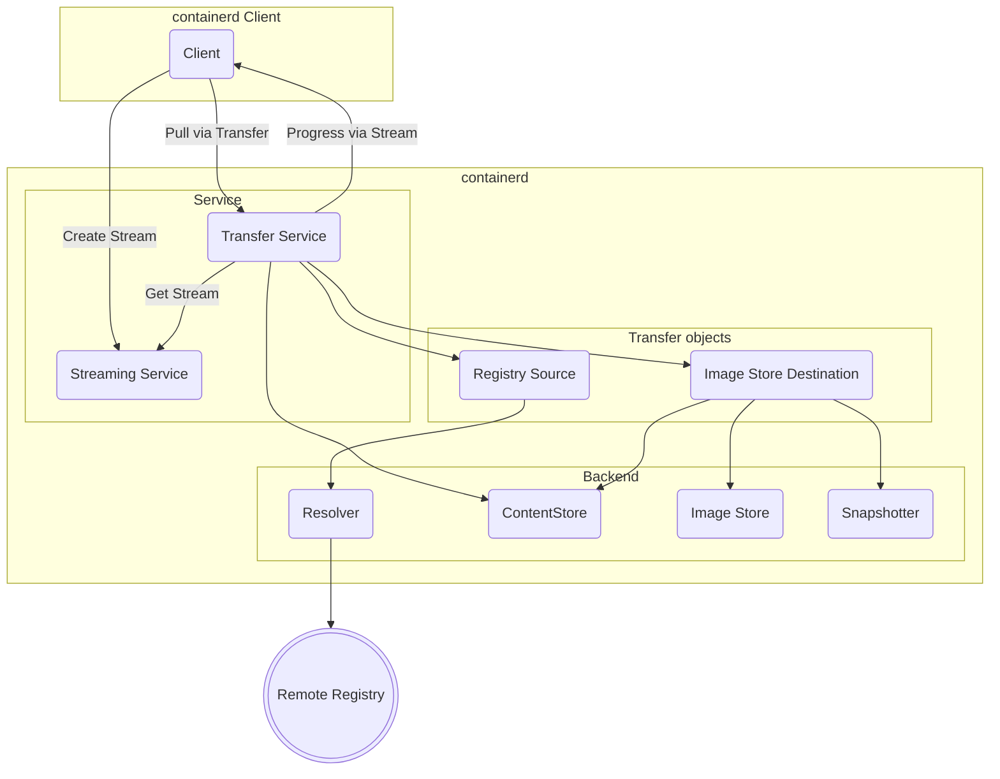

# Transfer Service

The transfer service is a simple flexible service which can be used to transfer artifact objects between a source and destination. The flexible API allows each implementation of the transfer interface to determines whether the transfer between the source and destination is possible. This allows new functionality to be added directly by implementations without versioning the API or requiring other implementations to handle an interface change.

The transfer service is built upon the core ideas put forth by the libchan project, that an API with binary streams and data channels as first class objects is more flexible and opens a wider variety of use cases without requiring constant protocol and API updates. To accomplish this, the transfer service makes use of the streaming service to allow binary and object streams to be accessible by transfer objects even when using grpc and ttrpc.

## Transfer API

The transfer API consists of a single operation which can be called with various different objects depending on the intended operation.

In Go the API looks like,
```go
type Transferrer interface {
	Transfer(ctx context.Context, source interface{}, destination interface{}, opts ...Opt) error
}
```

The proto API looks like,
```proto
service Transfer {
	rpc Transfer(TransferRequest) returns (google.protobuf.Empty);
}

message TransferRequest {
	google.protobuf.Any source = 1;
	google.protobuf.Any destination = 2;
	// + options
}
```

## Transfer Objects (Sources and Destinations)

## Transfer Operations

|   Source    | Destination | Description | Local Implementation Version |
|-------------|-------------|-------------|-----------------------|
| Registry    | Image Store | "pull"      | 1.7 |
| Image Store | Registry    | "push"      | 1.7 |
| Object stream (Archive) | Image Store | "import" | 1.7 |
| Image Store | Object stream (Archive) | "export" | 1.7 (in progress) |
| Object stream (Layer) | Mount/Snapshot | "unpack" | Not implemented |
| Mount/Snapshot | Object stream (Layer) | "diff" | Not implemented |
| Image Store | Image Store | "tag" | Not implemented |
| Registry | Registry | mirror registry image | Not implemented |

### Local containerd daemon support

containerd has a single built in transfer plugin which implements most basic transfer operations. The local plugin can be configured the same way as other containerd plugins
```
[plugins]
[plugins."io.containerd.transfer.v1"]
```

## Diagram

Pull Components



## Streaming

Streaming is used by the transfer service to send or receive data streams as part of an operation as well as to handle callbacks (synchronous or asynchronous). The streaming protocol should be invisible to the client Go interface. Object types such as funcs, readers, and writers can be transparently converted to the streaming protocol when going over RPC. The client and server interface can remain unchanged while the proto marshaling and unmarshaling need to be aware of the streaming protocol and have access to the stream manager. Streams are created by clients using the client side stream manager and sent via proto RPC as string stream identifiers. Server implementations of services can lookup the streams by the stream identifier using the server side stream manager.

### Progress

Progress is an asynchronous callback sent from the server to the client. It is normally representing in the Go interface as a simple callback function, which the the client implements and the server calls.

From Go types progress uses these types
```go
type ProgressFunc func(Progress)

type Progress struct {
	Event    string
	Name     string
	Parents  []string
	Progress int64
	Total    int64
}
```

The proto message type sent over the stream is

```proto
message Progress {
	string event = 1;
	string name = 2;
	repeated string parents = 3;
	int64 progress = 4;
	int64 total = 5;
}
```

Progress can be passed along as a transfer option to get progress on any transfer operation. The progress events may differ based on the transfer operation.

### Binary Streams

Transfer objects may also use `io.Reader` and `io.WriteCloser` directly.

The bytes are transferred over the stream using two simple proto message types
```proto
message Data {
	bytes data = 1;
}

message WindowUpdate {
	int32 update = 1;
}

```

The sender sends the `Data` message and the receiver sends the `WindowUpdate` message. When the client is sending an `io.Reader`, the client is the sender and server is the receiver. When a client sends an `io.WriteCloser`, the server is the sender and the client is the receiver.

Binary streams are used for import (sending an `io.Reader`) and export (sending an `io.WriteCloser`).

### Credentials

Credentials are handled as a synchronous callback from the server to the client. The callback is made when the server encounters an authorization request from a registry.

The Go interface to use a credential helper in a transfer object looks like
```go
type CredentialHelper interface {
	GetCredentials(ctx context.Context, ref, host string) (Credentials, error)
}

type Credentials struct {
	Host     string
	Username string
	Secret   string
	Header   string
}

```

It is send over a stream using the proto messages
```proto
// AuthRequest is sent as a callback on a stream
message AuthRequest {
	// host is the registry host
	string host = 1;

	// reference is the namespace and repository name requested from the registry
	string reference = 2;

	// wwwauthenticate is the HTTP WWW-Authenticate header values returned from the registry
	repeated string wwwauthenticate = 3;
}

enum AuthType {
	NONE = 0;

	// CREDENTIALS is used to exchange username/password for access token
	// using an oauth or "Docker Registry Token" server
	CREDENTIALS = 1;

	// REFRESH is used to exchange secret for access token using an oauth
	// or "Docker Registry Token" server
	REFRESH = 2;

	// HEADER is used to set the HTTP Authorization header to secret
	// directly for the registry.
	// Value should be `<auth-scheme> <authorization-parameters>`
	HEADER = 3;
}

message AuthResponse {
	AuthType authType = 1;
	string secret = 2;
	string username = 3;
	google.protobuf.Timestamp expire_at = 4;
}
```
